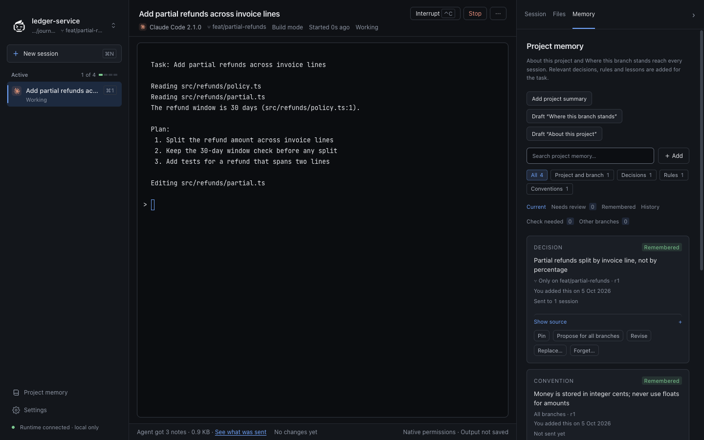

# Journal

Journal is a local-first workspace for Claude Code, Codex and Cursor that carries reviewed project knowledge across agent sessions.

Switching agents should not mean rediscovering architecture decisions, constraints, failed approaches, and current project context.

**Early-stage alpha.** The terminal-first workflow works today; the larger roadmap is still in development. No packaged or signed public release is available yet.




*Fixture data: a throwaway repository and a stand-in agent CLI, captured headless with `scripts/readme-screenshot.mjs`.*

## Why Journal?

- Coding agents repeatedly rediscover the same project context.
- Decisions and lessons get trapped inside individual sessions.
- Switching between Claude Code and Codex can lose continuity.
- Journal keeps reviewed knowledge local and selectively supplies it to future sessions.
- Context previews and receipts show the exact knowledge packet and launch text supplied to the CLI.

## What works today

- **Local Git projects and native terminals:** open an existing checkout and run Claude Code, Codex or the Cursor Agent CLI with its existing login, settings, and permission prompts.
- **Cursor:** shown as a provider even before its CLI is installed. Install and sign-in run Cursor's own official commands in a visible terminal, only after you confirm; Journal never handles Cursor credentials. Each Cursor chat is created first so Journal can resume that exact chat; Research starts Cursor in Ask mode and Plan in Plan mode. See [providers](docs/PROVIDERS.md); authenticated validation is still manual.
- **Up to four sessions at once:** a separate local runtime owns the terminals, so reloading the UI, an app crash, or choosing *Keep running in background* on quit leaves agents running; reopening Journal reconnects. A runtime crash is recovered explicitly, without resending prompts.
- **Session views:** per-session state and attention markers, a changes view against the session's starting commit, and an activity timeline with observed commands and exit codes (Claude Code hooks; Codex and Cursor report their turns and activity through their own hooks, see docs/PROVIDERS.md).
- **Status-update helper:** propose a branch update or repo overview drafted from Git history; nothing is saved until you review and approve it.
- **Projects:** rename how a project appears in Journal, pin it, add related folders (another repository, docs, a plugin) as context, or remove it from Journal. Your files are never deleted or renamed.
- **Sessions and menus:** rename, pin, archive or remove sessions, and right-click projects or sessions for common actions (reveal, copy path, copy native session ID, resume, stop). Removing never touches files and never silently stops a running agent.
- **Files:** a read-only explorer in the right panel follows the session's workspace, shows Git state, previews files, and hands files or selected lines to the agent as references (paths and line ranges, never pasted contents). It does not edit files.
- **Workspaces:** run a session in the current checkout, a Journal-managed Git worktree created from a base you choose, or an existing worktree. Journal never force-removes, stashes or copies your uncommitted work. Research mode starts each CLI in its own read-only mode (Claude plan mode, Codex read-only sandbox, Cursor Ask mode); it can be changed inside the session, so it is an intent rather than enforcement.
- **Knowledge controls:** pin rules, leave a claim out for one task, mark it incorrect, supersede it, or propose a branch rule for all branches. A deterministic inbox suggests rules you stated in tasks and observed passing test commands, for your review.
- **Data:** integrity-checked backups and restore, knowledge export/import (imports wait for review), session purge, and automatic trimming of old timelines.
- **Reviewed project knowledge:** manually add and approve repo overviews, branch updates, decisions, constraints, conventions, lessons, and issues, backed by a source note or tracked-file excerpt.
- **Checkout and exact-branch scope:** eligible project briefs orient Journal-launched sessions, including empty tasks; task-specific knowledge uses bounded lexical retrieval and source-freshness checks.
- **Context visibility:** preview selected knowledge and exclusions; immutable receipts preserve the launch prompt and delivery state. A receipt records transport, not model acknowledgment.
- **Exact native resume:** explicitly resume a confirmed native session instead of selecting the latest conversation. Codex requires confirmation of its native UUID.
- **Persistent local storage:** knowledge, source excerpts, tasks, session metadata, and receipts stay in Journal's local data directory. Native CLIs send supplied context to their providers according to their own settings.
- **Desktop controls:** blue-accented light/dark themes, keyboard shortcuts, and resizable sidebars retain the live terminal when appearance or layout changes.
- **Source-available:** free to use locally, and free to inspect, modify, and self-host under the [Elastic License 2.0](LICENSE).

## Download and install

Download the latest build from [GitHub Releases](https://github.com/adirz101/Journal/releases). No Node.js, npm or source checkout is needed. Journal does not include the agent CLIs: install Claude Code, Codex and/or the Cursor Agent CLI with their own installers and logins (Journal shows which it found, and can run Cursor's official installer for you after you confirm).

**macOS (Apple Silicon)**
1. Download `Journal-<version>-arm64.dmg`.
2. Open it.
3. Drag **Journal** to **Applications**.
4. Open Journal from Applications. macOS builds are signed with an Apple Developer ID and notarized by Apple, so Gatekeeper does not block them (macOS still asks once to confirm opening an app downloaded from the internet).

**Windows (x64)**
1. Download `Journal-Setup-<version>-x64.exe` (installs for your user in one click, no administrator rights, Start Menu shortcut, uninstall from Settings → Apps) or `Journal-Portable-<version>-x64.exe` (runs without installing).
2. Run it.
3. Alpha builds are unsigned, so SmartScreen may warn ("Windows protected your PC"): choose **More info** → **Run anyway**.

Journal keeps its data per user (macOS `~/Library/Application Support/journal-desktop`, Windows `%APPDATA%\journal-desktop`), also for the portable build; uninstalling keeps it. Verify a download against the release's `SHA256SUMS.txt` (macOS: `shasum -a 256 -c SHA256SUMS.txt --ignore-missing`; Windows: `Get-FileHash <file> -Algorithm SHA256`). Intel Macs are not built yet. See [releasing](docs/RELEASING.md) for signing status.

**Updates.** From 0.1.0-alpha, installed builds check GitHub Releases in the background, download new versions and show **Restart to update** at the right of the bottom bar (in the sidebar while no project is open); Journal never restarts on its own, and asks what to do with running sessions first (on Windows they are stopped for the update). Check any time with **Check for Updates…** (the Journal menu on macOS, Help on Windows); automatic checks can be switched off under **Data and backups**. The Windows portable build shows when a new version is available and links to it.

## Current limitations

- Alpha software: Windows builds are not code-signed yet (macOS builds are signed and notarized), and updates reach builds from 0.1.0-alpha onward (earlier 0.2.0-alpha test builds: install 0.1.0-alpha by hand once). Sessions in the same checkout share its working tree; use a worktree for isolation.
- Local validation is on macOS. Native Windows operation is unverified; see the [Windows audit](docs/WINDOWS.md).
- Knowledge and status updates require manual review. Automatic extraction, cloud sync, background agent orchestration, and cross-worktree knowledge promotion are not implemented.
- Retrieval is lexical (stemmed, with identifier and path aliases), with finite context limits. Source fingerprints detect changes; they do not establish whether a claim is true. Journal does not inject context into conversations launched outside the app.
- Observability depends on what the native CLI exposes. Interactive Codex approvals, broader running-tool cancellation, crash cleanup, and detached child processes remain validation gaps.

## Run from source

Requirements (development only; release builds need none of these):

- Node.js **24 or newer** and Git.
- An installed `claude` and/or `codex` CLI on `PATH`, with its native login configured.
- A C++ toolchain for native modules: Xcode command-line tools on macOS, or Visual Studio C++ build tools on Windows.

From the repository root:

```sh
npm ci
npm run dev
```

To run the production renderer:

```sh
npm run build
npm start
```

If node-pty has been rebuilt for system Node, restore Electron compatibility with `npm run rebuild`.

On macOS, development and start commands use a cached local `Journal.app` runtime. It opens this checkout directly, including when launched without CLI arguments. This checkout-bound runtime is not a distributable or signed release.

Data remains in the `journal-desktop` directory under Electron's application-data location; set `JOURNAL_DATA_DIR` to use another directory. Terminal output and keystrokes are volatile and live only in the runtime's bounded memory. Reloading or reopening reconnects to running sessions; quitting asks whether to stop them or keep them running; a stopped session needs explicit native resume.

## Screens

- **Welcome.** Shown while no project is open: **Open a project…** (or drop a folder on the window) and one row per agent (Claude Code, Codex, Cursor) saying whether it is installed and signed in, with one action each (**Install…**, **Sign in…**, **Check again**). Install and sign-in run the agent's own command in a visible terminal after you confirm.
- **Getting to know your project.** The first time a project without notes is opened, Journal drafts *About this project* and *Where this branch stands* from Git (no AI call; nothing leaves the computer). Fill in **Working on now** and **Next**, then **Remember both**, edit one, or **Skip for now**.
- **Sidebar.** The project switcher, **New session**, the active sessions with their slot keys and states (*Working*, *Needs approval*, *Your turn* when the agent's hooks report them: Claude, Codex once its hooks are trusted, Cursor's turns with Cursor turn status; otherwise *Running · output just now* or *quiet*, marked *Limited status*), recent sessions by day, **Project memory** with a count of notes waiting for review, **Settings** and the runtime line. Below 1180 px it folds to a rail.
- **New session.** The task box (matched words are underlined), agent cards, the **Build / Plan / Read-only** mode, the workspace, one **Start** button, and a live preview of what the agent will know: notes every session gets, notes relevant to this task, and their size.
- **Session.** A header with the agent, workspace, mode and state; a banner naming the command when Claude waits for your approval (you answer in the terminal); the native terminal; and a status bar with how many notes the agent got (**See what was sent**), the changes against the session's start and whether output is saved.
- **Inspector.** Three tabs: **Session** (what the agent was told and what it did), **Files** (Changed, or the whole read-only tree with previews and references) and **Memory** (search, categories, Needs review, Check needed and other branches). Below 1440 px it folds to a rail and opens as an overlay.
- **Wrap-up.** When a session ends: its summary, suggestions worth keeping (**Remember**, **Remember all**, Edit, Dismiss with Undo), an out-of-date catch when the session changed a file a note cites (the note and the changed lines side by side, with **Update note…**, **Still true** and **Forget…**), **Continue** to resume the same conversation, and hand-off to another agent. An error exit leads with the last output.
- **Command palette.** ⌘K / Ctrl+Shift+P: one search over sessions (live ones by slot), quiet Codex and Cursor sessions to check, every action (a blocked one says why) and remembered notes; type `>` for actions only. Arrow keys move, Enter runs, Escape returns focus where it was. With no match it offers a new session with that task.
- **Switch branch.** The branch beside the Files tab's root picker (also a Git root's context menu, the session header and the command palette): search every local and remote branch of one repository at a time (the checkout, a worktree or an added Git folder) and press Enter. Journal runs a plain `git switch` (creating a local tracking branch from a remote one asks first), never forces or stashes, and refuses while a session runs in that repository.
- **Open any file.** ⌘P / Ctrl+Shift+O: searches the files Git lists in the Files tab's current folder (ignored and sensitive paths left out) and previews the chosen file there; from the composer's **Add reference…** it adds the file as a reference.
- **When something fails.** A banner while the local runtime is disconnected, with **Reconnect now**; after a runtime crash, a recovery list of the sessions it ended, with **Continue**, **Confirm ID…** or **Review**; a card above **Start** when an agent is missing, unsupported, signed out or cannot start, with **Open terminal**, **Copy command** and **Check again**; with four sessions running, Start says to stop or finish one first; and if the window itself stops, a plain page says so with **Reload**, which reopens the project and reattaches the running sessions without resending anything.
- **Settings.** Appearance, notifications (Claude approvals, with the command hidden by default), updates, and data and backups.

## Basic workflow

1. **Open a project.** Choose an existing Git checkout, and remember the two drafted notes on the first visit (or skip).
2. **Start a session.** Type the task, pick the agent and mode, check the preview, and press **Start** (⌘↵ / Ctrl+Enter). Work and approve tools in the native terminal.
3. **Run several agents.** Up to four sessions at once, across projects or providers. ⌘J / Ctrl+Shift+J jumps to the next session that needs you.
4. **Keep what was learned.** The wrap-up suggests notes; one click remembers a suggestion whose whole statement is on screen. Notes can also be added and reviewed in **Memory**.
5. **Resume explicitly.** **Continue** reopens the exact native conversation. Codex needs its native UUID confirmed first. Journal never falls back to the latest session.

### Keyboard shortcuts

App shortcuts work while the terminal has focus: Journal claims them before the terminal sees them. Every other key, such as Ctrl+C, Ctrl+R, Ctrl+K, Ctrl+P or Alt+letter, goes to the terminal. While a dialog is open, keys work as usual inside it. Standard window keys such as ⌘W (Ctrl+W) belong to the app menu.

| Action | macOS | Windows and Linux |
| --- | --- | --- |
| New session | ⌘N | Ctrl+Shift+N |
| Open a project | ⌘O | Ctrl+O (outside the terminal) |
| Switch to active session 1–4 | ⌘1–⌘4 | Alt+1–Alt+4 |
| Next session that needs you | ⌘J | Ctrl+Shift+J |
| Focus the terminal | ⌘E | Ctrl+Shift+E |
| Inspector: Session, Files, Memory | ⌥⌘1, ⌥⌘2, ⌥⌘3 | Alt+Shift+1, Alt+Shift+2, Alt+Shift+3 |
| Show or hide the inspector | ⌘I | Ctrl+Shift+B |
| Show or hide the sidebar | ⌘\ | Ctrl+Shift+\ |
| Add a note | ⇧⌘K | Ctrl+Shift+K |
| Settings | ⌘, | Ctrl+, |
| Command palette | ⌘K or ⇧⌘P | Ctrl+Shift+P |
| Open any file | ⌘P | Ctrl+Shift+O |
| Start, in the task box | ⌘↵ | Ctrl+Enter |
| Remember both, on Getting to know your project | ⌘↵ | Ctrl+Enter |
| Wrap-up: Continue / Remember all | ⌘↵ / ⇧⌘↵ | Ctrl+Enter / Ctrl+Shift+Enter |

The terminal keeps the Tab key, so the keyboard leaves it with ⌥⌘2 / Alt+Shift+2 (Files), ⌘N / Ctrl+Shift+N (the task box) or a dialog key, and ⌘E / Ctrl+Shift+E returns. ⌥⌘1 and ⌥⌘3 switch the inspector tab and leave focus in the terminal. **Interrupt** also sends an interrupt to the native process. The keys come from [`src/desktop/shortcuts.mjs`](src/desktop/shortcuts.mjs).

Change appearance in **Settings**. Drag either sidebar's inner edge to resize it, or focus the divider and use arrow keys (Shift for larger steps), Home/End for limits, or Enter to reset. Double-click also resets. Theme and widths are saved locally.

## Development / verification

Fixture-only GitHub Actions run CI on macOS, Linux and (experimentally) Windows, and the release workflow packages and smoke-tests macOS and Windows builds; they never use provider logins. Provider trials stay manual and local. See [CONTRIBUTING.md](CONTRIBUTING.md).

```sh
npm test
npm run check
npm run build
npm run test:desktop
npm run smoke:agents
npm run pilot:memory
```

The [current implementation status](docs/IMPLEMENTATION-STATUS.md) records 640 passing unit tests, a passing typecheck and production build, and 144 passing desktop tests, run headless (1 skipped: a Windows/Linux-only key check). Desktop checks use real Electron, the runtime process and node-pty with controlled fixture CLIs, never a real provider CLI or login: they cover context delivery, resume, four concurrent sessions, reload, window, app and runtime crashes, process cleanup, worktrees, the redesigned screens with keyboard-only walkthroughs and accessibility audits in both themes, and the changes view. These fixtures do not establish authenticated provider behavior; the [To verify](docs/NATIVE-VALIDATION.md#to-verify) checklist lists what still needs real CLIs, Windows hardware and screen readers.

`smoke:agents` checks installed native CLI startup without submitting a task or accepting trust prompts. `pilot:memory` evaluates local retrieval against 28 frozen synthetic claims and 20 labelled tasks without provider requests; it measures scope/evidence exclusion and lexical relevance, not model quality or time savings.

Separate [authenticated native trials](docs/NATIVE-VALIDATION.md) observed Codex/Claude tasks, reviewed knowledge handoff, exact resume, Claude manual approval/refusal, and Codex inference interruption. A [follow-up](docs/LIFECYCLE-AND-MEMORY-VALIDATION.md) observed native UUID-hint capture and background-command stopping with CLI exit. Codex used invocation-only `gpt-5.6-luna` for these bounded trials; permanent settings were unchanged. These results do not establish universal process cleanup or Windows support.

## Architecture / docs

Journal uses Electron and React for the app, a separate local runtime process with node-pty for terminals, xterm.js for display, and SQLite for reviewed knowledge, session metadata and immutable receipts. See [ARCHITECTURE.md](docs/ARCHITECTURE.md).

- **Providers:** [Versions and observability](docs/PROVIDERS.md).
- **Releasing and benchmarks:** [Release process](docs/RELEASING.md) and [usefulness benchmark](docs/BENCHMARK.md).
- **Current contract:** [Terminal-first specification](docs/TERMINAL-FIRST-SPEC.md) and [foundation architecture decision](docs/adr/002-terminal-first-foundation.md).
- **Project orientation:** [Repo overviews and branch updates](docs/PROJECT-ORIENTATION.md).
- **Implementation status:** [What is implemented, verified, and still open](docs/IMPLEMENTATION-STATUS.md).
- **Native validation:** [Authenticated provider trials](docs/NATIVE-VALIDATION.md) and [lifecycle/retrieval follow-up](docs/LIFECYCLE-AND-MEMORY-VALIDATION.md).
- **Research:** [Source ledger](docs/RESEARCH.md).
- **Historical design / roadmap:** [Executive summary](docs/EXECUTIVE-SUMMARY.md), [original design](docs/JOURNAL-DESIGN.md), and [full-product roadmap](docs/IMPLEMENTATION-PLAN.md). These describe broader plans, not today's feature set.

## Contributing

Contributions, issues, and feedback are welcome; see [contributing](CONTRIBUTING.md). Contributions are accepted under the same Elastic License 2.0 terms as the rest of Journal.

## License

Journal is source-available under the [Elastic License 2.0 (ELv2)](LICENSE). You can use it for free, inspect and modify the code, and self-host it. ELv2 does not allow offering Journal itself to third parties as a hosted or managed service, and modified copies must keep the license and copyright notices. Journal is not open source in the OSI sense. Third-party components keep their own licenses; see [third-party notices](THIRD_PARTY_NOTICES.md).

Copyright 2026 Adir Zak
