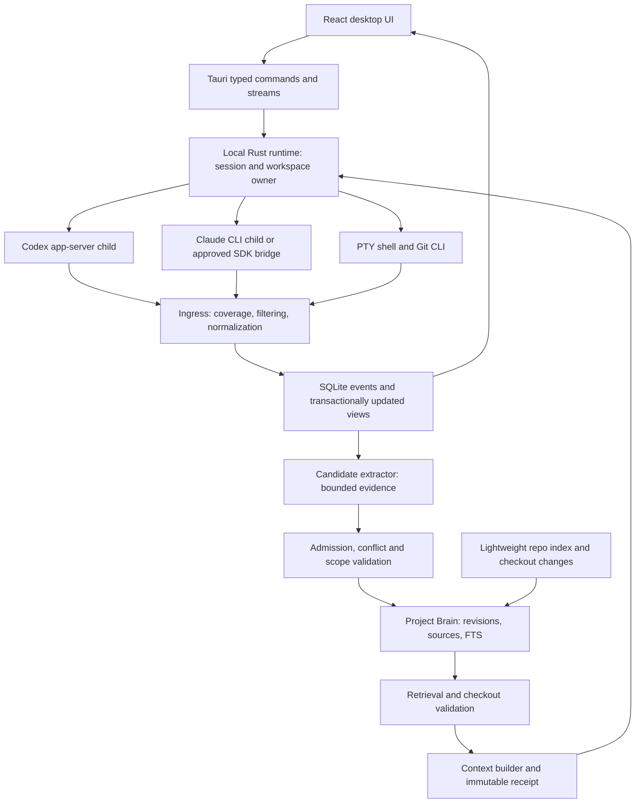

# Journal: research and proposed design

**Current testing policy:** all checks are manual and local on the user's computer. No CI, hosted runners, nightly tests or scheduled verification. This policy supersedes historical testing proposals below.

Research date: **1 October 2026**. Status: **proposal; no product implementation**.

The founder's brief asks for an open-source, local-first Mac/Windows workspace for individual developers, initially using Codex and Claude, whose project knowledge survives a change of agent. This document challenges that premise before recommending an implementation. The technical document is in English for future contributors; the accompanying executive brief is also in English.

Evidence labels: **Verified** means inspected primary documentation or source; **Inference** means our interpretation of that evidence; **Proposal** means a Journal design choice; **Unproven** means a spike or user study is required. Documentation verification does not mean the product was run. No authenticated model sessions, Windows tests, performance measurements, or trademark clearance were performed in this planning phase.

## 1. Executive summary

**Recommendation: MODIFY, then conditional GO.** Do not build a general agent desktop first. Build the smallest workspace that demonstrates trustworthy project knowledge moving from a Codex implementation session into a Claude review session.

The generic workspace market is crowded. Third-party agent workspaces and native vendor applications already cover substantial parts of agent execution, parallel work, worktrees, transcripts, approvals, terminals, and review. Current Claude and Codex also have memory features, and dedicated memory tools make cross-session and cross-agent memory much less novel than the initial brief suggests. See the [research ledger](RESEARCH.md) for inspected source files and limits.

The defensible hypothesis is narrower: **evidence-backed knowledge, qualified against the target checkout, with an exact receipt of what was supplied to each agent**. A memory needs an origin, applicable scope, current evidence, and a way to be corrected. Failed approaches and compatibility constraints are especially promising. A polished list of remembered facts is insufficient.

Choose **Tauri 2 + React/TypeScript/Vite + Rust + SQLite FTS5**, provisionally. Use official Codex app-server over stdio. For Claude, distinguish a user's interactive installed CLI from an embedded SDK product; SDK integration should use API authentication unless Anthropic approves subscription use. A PTY-hosted CLI is technically possible, but the terms do not establish a blanket exception for third-party products. Do not promise the subscription experience until that ambiguity is resolved. [Anthropic SDK policy](https://code.claude.com/docs/en/agent-sdk/overview), [credential-use policy](https://code.claude.com/docs/en/legal-and-compliance).

An open-source local Codex application can use app-server authentication under the current documentation; commercial/hosted services have a different boundary. Do not carry local authentication assumptions into future paid runners. [Codex app-server](https://learn.chatgpt.com/docs/app-server#authentication).

Make embeddings optional after a lexical baseline. Use bounded candidate extraction after turns or task completion, not continuous model processing. Automatically retain narrow validated facts; put causal conclusions and unimplemented decisions in a confirmation inbox. Keep history separate from knowledge. Ship no Journal account, cloud service, telemetry, plugin marketplace, model rankings, editor, or team task system.

Public MVP is gated on a useful cross-provider workflow on both macOS and native Windows. If the required Claude subscription integration cannot be supported, explicitly change the product promise to Claude API access or release a memory companion first. This is a product decision, not a workaround hidden in an adapter.

## 2. Market reality and gap

The comparison separates persistent curated knowledge from saved conversation, reusable prompts, project instructions, and task summaries. These are useful but different. “Not established” is deliberately weaker than “does not exist.” A finite source inspection cannot prove a feature's absence.

| Product | Multi-agent workspace; Codex + Claude | Memory/context evidence | Observability evidence | Implication |
|---|---|---|---|---|
| Third-party agent workspaces | Several desktop and terminal apps already run Claude and Codex side by side, in parallel worktrees, through wrapped CLIs or structured adapters | Project setup, instructions, prompts and persistent sessions; repository-aware durable memory governance not established in inspected sources | Terminals, agent activity, diffs and review | Very strong overlap with the proposed shell; execution alone is not a differentiator |
| Codex desktop/CLI | Vendor workspace, worktree and memory features; not a first-party Claude execution wrapper | Native Memories plus AGENTS guidance | Official app-server exposes structured execution | Memory alone is already a vendor feature |
| Claude Code | CLI and desktop; not a vendor-neutral Codex cockpit | CLAUDE.md, rules and auto memory shared across repo worktrees | Hooks, print streams, SDK and monitoring | Repo memory is already an installed workflow |
| Third-party memory tools | Memory layers and services, not verified as complete execution/worktree cockpits | Hook- or MCP-based capture, extraction, recall, decay and conflict logic, some with Codex integration | Memory sources and viewers; full execution trace not established | Strong counterexamples to “shared, automatic durable memory is new” |
| Mem0 / Graphiti | Memory infrastructure, not a complete CLI desktop cockpit | Extraction/retrieval; Graphiti explicitly models temporal facts and provenance | Integration-dependent | Reuse concepts; avoid a mandatory graph server or service stack |
| Langfuse / Phoenix | Observability platforms, not Git/PTY workspaces | Trace and retrieval analysis, not authoritative repo knowledge | Instrumented calls/spans/evaluations | They cannot expose uninstrumented CLI internals or hidden reasoning |

Evidence: [Codex customization](https://learn.chatgpt.com/docs/customization/overview), [Claude memory](https://code.claude.com/docs/en/memory), [Mem0](https://github.com/mem0ai/mem0), [Graphiti](https://github.com/getzep/graphiti), [Langfuse deployment](https://github.com/langfuse/langfuse/blob/main/docker-compose.yml), [Phoenix](https://github.com/Arize-ai/phoenix).

**Answer to the five-part market question:** the reviewed sources do not establish one product satisfying all five requirements with repository/branch validity, explainable automatic retrieval, and honest trace coverage. They do establish that the components and close substitutes exist. Combining an existing agent workspace with an existing memory tool is a credible alternative. No claim of worldwide uniqueness is justified.

**Inference:** the gap is primarily memory reliability and workflow integration, not number of supported agents. Validate against that assembled baseline as well as native agent memory. Otherwise Journal would mostly replace familiar UI while adding another source of stale instructions.

### Three viable approaches

| Approach | Benefit | Cost | Recommendation |
|---|---|---|---|
| Small desktop with Brain + context receipts | Controls the end-to-end learning/reuse experience | Owns adapters, PTY, packaging, security | Conditional GO after integration and memory gates |
| Brain companion: MCP + hooks + small knowledge UI | Tests differentiation without rebuilding execution | Less control over trace coverage and approval UX | Best fallback and useful initial validation vehicle |
| Fork/contribute to an existing cockpit | Gets mature workspace infrastructure | Upstream coupling, licensing and product-direction constraints | Evaluate before shell implementation; do not assume forking is free |

## 3. Product thesis, audience and success

**Thesis:** “The project remembers, even when the agent changes.” Operational meaning: a future session receives a small set of project-specific claims that are still applicable, can follow the evidence, and can challenge them.

Target: individual developers who repeatedly work in one repository, switch between agents, and lose constraints or rediscover failures. Start with compatibility/debugging/review workflows, not automatic fleet management. EngineForge/Unity is an excellent stress case, but no EngineForge repository was inspected here.

Proposed adoption gate: recruit 5–10 developers with real recurring tasks. Compare no added memory, a curated AGENTS/CLAUDE document, native memory, and an existing cockpit + memory tool. Measure repeated failed approaches, correction burden, relevant memories per task, context overhead, and whether users return the next week. Set success targets before the pilot: at least half choose continued use, median review burden below two minutes per completed task, and no critical wrong-scope injections. These are decision targets, not market forecasts.

For effectiveness, use paired tasks on frozen checkouts and report raw outcomes; a small sample is directional evidence. Do not claim an agent became faster because one task happened to use more memories.

## 4. What Journal is not

It is not a code editor, language server, issue tracker, Kanban system, Git staging client, replacement agent harness, credential proxy, terminal renderer, general personal memory store, or platform for inspecting proprietary reasoning. Open files in the user's editor. Use Git CLI and xterm.js. A read-only file explorer (browsing, Git status, text preview and file references for agents; see [FILE-EXPLORER-DESIGN.md](FILE-EXPLORER-DESIGN.md)) was approved by the user in October 2026; editing, file operations, editor tabs, language servers and source-control actions remain out of scope. Keep approvals and native agent security intact. No automatic merge, push, branch deletion, or arbitrary repository setup execution.

## 5. Smallest credible MVP and priorities

Public MVP: open local Git repo; run Codex and a supported Claude integration; a few independent sessions; choose current checkout or isolated worktree; conversation where structured output exists; terminal fallback; basic diff; honest timeline; durable Brain with candidate review; lexical retrieval; context receipt/inspector; SQLite; safe export/import; recover interrupted sessions; macOS and native Windows x64; no Journal cloud.

**Internal first cut is smaller:** one project, one session at a time, Codex structured transport, manually admitted evidence-linked memories, task-start lexical retrieval and exact context receipts. Then run Claude review using the supported integration. This tests the distinctive loop before tabs, parallelism and automatic extraction. It is not marketed as the full public MVP.

| Feature | Priority | Minimum or rationale |
|---|---|---|
| Local projects | MVP mandatory | Local Git repos; no clone service |
| Codex adapter | MVP mandatory | Official structured transport |
| Claude adapter | MVP mandatory, conditional | SDK/API or terms-cleared CLI mode; no unsupported subscription promise |
| Multiple sessions | MVP mandatory | Independent sessions; no orchestrator, start with tested concurrency of four |
| Worktree isolation | MVP mandatory | Optional, clean committed base; dirty snapshot transfer is V1 |
| Integrated terminal | MVP mandatory | One implementation using xterm.js/portable-pty |
| Conversation | MVP mandatory | Structured modes; CLI fallback may have partial transcript |
| File changes and diff | MVP mandatory | Workspace baseline, lazy plain review; external editor |
| Test/run output | MVP mandatory | Command exit status; parse supported test reports when present |
| Timeline | MVP mandatory | Ordered events/filter/details, no profiler UI |
| Context Inspector | MVP mandatory | Exact Journal packet, sources/reasons/limits |
| Project Brain | MVP mandatory | Searchable cards, evidence, edit/reject/status/pin |
| Candidate extraction | MVP mandatory | Deterministic + bounded optional model extraction; manual mode always works |
| Automatic retrieval | MVP mandatory | FTS + paths + scope validation at task start |
| Session history | MVP mandatory | Redacted event/message history; explicit coverage gaps |
| Export/import | MVP mandatory, narrow | Versioned Brain JSON/Markdown, evidence manifest; untrusted import |
| Adapter interface | MVP mandatory, internal | Capability contract and fixtures, not a plugin SDK release |
| Brain duplicate review/merge | MVP mandatory | Simple compare/choose, preserve sources |
| All-history portable export | V1 | Redaction preview, larger attachments and schema evolution |
| Mid-session automatic retrieval | V1 | Bounded triggers; avoid feedback loops |
| Tree-sitter symbols / semantic retrieval | V1 | Only if measured lexical misses justify it |
| MCP memory server | V1 | Read + candidate submission; initial context must work without it |
| Rich test adapters and review annotations | V1 | After basic trace/receipt reliability |
| Dirty-worktree snapshot transfer | V1 | Explicit preview, exclusions and preserved origin |
| Bundled local extraction model | Later | Download, hardware/cost and quality burden |
| External adapter SDK/plugins | Later | Version contracts before third-party execution |
| Linux / WSL / Windows ARM | Later | Separate environment targets, not implicit native parity |
| Cloud sync, remote runners, teams | Later | No local entitlement or dependency |
| Provider performance comparisons | Later | Only with matched workloads and coverage |
| Hidden reasoning viewer / synthetic quality score | Do not build | Inaccessible or misleading |
| Full IDE, Jira, Git GUI, own terminal/vector DB | Do not build | Commodity scope would obscure the thesis |

## 6. Architecture and responsibility boundaries

Proposed application: one installed desktop product with a small **local runtime child process**. This process boundary exists to preserve long sessions when a renderer/window crashes; it is not a microservice deployment. Rust modules remain one core crate initially. Add a Node sidecar only if the approved Claude SDK route requires it.



Runtime owns processes, file access, Git operations, permission request routing, provider session IDs, storage and secrets filtering. UI owns presentation only. The event writer commits events and projection updates together; UI subscribes after commit. Do not deploy Kafka, Redis, Postgres, a vector daemon or HTTP service for the MVP.

Operational state uses small explicit state machines. No general event-sourcing framework: retain normalized events and transactional projections, but avoid requiring replay of arbitrary historic tool effects to start the application. A provider response and a user-visible receipt are separate from completed filesystem side effects.

Key invariants:

1. All persisted Journal content crosses the redaction gate first, including diagnostics and exports.
2. A session executes in one identified workspace/environment; a memory lookup never silently changes repo.
3. At most one Journal writer per current checkout. Worktrees support independent writers. External writers remain detectable but not controllable.
4. Memory updates never mutate the packet already sent to an agent.
5. An approval belongs to one live request, session and connection generation.
6. Unsupported observability is recorded as unknown, never as zero activity.
7. Provider resume does not mean replaying an unacknowledged prompt automatically.
8. A task's durable knowledge may outlive raw history, with explicit evidence-retention status.

## 7. Desktop stack recommendation

| Stack | Fit | Main tradeoff | Decision |
|---|---|---|---|
| Tauri 2, Rust, React/TS | System webviews, OS/process control, SQLite, Mac/Windows packaging | Rust skill and WKWebView/WebView2 variance; SDK may add a sidecar | Preferred, pending PTY/packaging spike |
| Electron, Node, React/TS | Mature desktop distribution; straightforward Claude TS SDK + node-pty | Chromium/runtime footprint and renderer attack surface | Strong fallback if SDK/PTY integration saves substantial maintenance |
| Electrobun | TS-centric native desktop alternative | Smaller ecosystem, platform/release-target changes; current core docs do not promise Intel Mac artifacts | Evaluate, not preferred for the stated support matrix |
| Swift/AppKit + separate Windows UI | Excellent native Mac experience | Duplicate app/UX implementation and maintenance | Reject for individual-maintainer cross-platform MVP |
| Qt or .NET/Avalonia | Real native cross-platform options | Weaker match for React/xterm and planned contributor pool | No demonstrated advantage for this project |

Verified stack facts: [Tauri system webview model](https://v2.tauri.app/start/), [Electron security](https://www.electronjs.org/docs/latest/tutorial/security), [Electrobun current platform guide](https://github.com/blackboardsh/electrobun/blob/main/docs/src/content/docs/electrobun/guides/cross-platform-development.mdx). Resource superiority is a hypothesis, not a benchmark. A Tauri app plus Node SDK bridge and several agent processes is not automatically small.

Use Tokio for asynchronous process/IPC work; rusqlite with bundled SQLite/FTS5 and a dedicated writer; portable-pty for actual terminals; notify with debounce/rescan for file watching; platform-native paths internally; Git CLI rather than reimplementing Git; React with a virtualized timeline and a small component library. Pin versions during the spike, not guessed versions in this document. Build-time Node is expected; the runtime product should not require a system Node unless that limitation is explicitly part of a preview.

Tauri command capabilities must not give the renderer arbitrary shell execution. IPC accepts workspace/session IDs and validated operations. The runtime independently authorizes filesystem roots. Do not ship a generic `exec(command)` endpoint to the UI.

## 8. Codex integration

**Verified transport:** `codex app-server`, stdio JSONL; initialize/initialized handshake; threads and turns; official schema generation tied to installed version. Use stdio, not the experimental TCP WebSocket route. `thread/start`, `thread/resume`, `turn/start` and `turn/interrupt` are the relevant lifecycle calls. Item notifications expose messages, commands, file changes and provider-exposed summaries; requests carry approvals. [Official protocol](https://learn.chatgpt.com/docs/app-server).

**Proposal:** one app-server process per active session in the initial runtime, deliberately trading some overhead for separate cwd/config/lifecycle ownership. Measure before consolidating processes. Store thread ID, provider version, workspace base, model, supported capabilities and auth mode. Parse stdout as protocol and stderr as separately filtered diagnostics. Cap JSONL frames; preserve unknown non-sensitive event types as unsupported records.

Discovery: resolve installed executable without invoking a shell, inspect `--version` and tested capability/schema surfaces. Generate protocol artifacts in a throwaway spike directory from supported versions; runtime ships reviewed schema definitions. Reject unsupported required methods with actionable diagnostics rather than assuming latest syntax.

Authentication: ask app-server `account/read`; use the CLI's own login if needed. No reading auth files, keychain tokens or external-token experiments. Do not sign the user out merely to close Journal. The local product never needs to mint OpenAI keys. If a user's selected provider requires a key, the provider owns it.

Context: guaranteed baseline is a clearly labeled Journal context block in the first `turn/start` text input, separate from the displayed user task. It avoids assuming a `developerInstructions` field exists in every schema. Support a documented developer-instruction configuration only after checking that installed version; do not replace native base instructions. Persist the exact composed text and transport acknowledgment. On resume, send a delta/revalidation note rather than all prior memory again.

Map item IDs to correlation IDs. Commands are observed commands, not guaranteed tests. A patch event identifies agent-reported changes; Git diff is authoritative for current workspace state. Arbitrary file reads inside `python`, a shell, or a subprocess cannot be enumerated reliably. No syscall auditing, private rollout scraping or monkeypatching runtime internals.

Compatibility risk: the inspected upstream repository and docs evolve rapidly. Support a declared version window and fixture matrix; retain original redacted payload shapes for debugging but never depend on undocumented transcript files as the primary protocol.

## 9. Claude integration and authentication gate

### Route A: user's interactive CLI in a PTY

Launch installed `claude` in the chosen workspace. Native login, permission prompts, slash commands and terminal behavior stay in the CLI. Use documented, explicitly enabled hooks for observable lifecycle/tool events. Claude supports hook `additionalContext`; a bounded UserPromptSubmit hook can supply the packet and return a local delivery receipt. Do not overwrite CLAUDE.md or global settings. [Hooks](https://code.claude.com/docs/en/hooks).

**Limitation:** a terminal plus hooks is not guaranteed to supply a complete structured conversation. Show “CLI mode: partial event coverage” and the real terminal. Hook delivery confirms the supplied context channel, not that every token reached or influenced a later model request. Avoid parsing ANSI screens as an authoritative transcript.

**Policy gate:** launching an existing CLI is different technically from collecting OAuth credentials, but the published credential terms do not conclusively authorize every commercial or open-source wrapper. Seek a concrete written clarification for this proposed mode before promising subscription-based Claude integration. Competitors' implementations are not permission evidence.

### Route B: structured Claude SDK with supported credentials

Use the official TypeScript Agent SDK through a minimal reviewed Node bridge. The documented SDK exposes `query`, streamed messages, session resume, hooks and approval callbacks. SDK setup/config differs from interactive CLI; explicitly select project settings, preserve native prompt defaults, and use append-style instructions. [SDK overview](https://code.claude.com/docs/en/agent-sdk/overview).

Use API-key or supported cloud-provider authentication for the third-party SDK product unless Anthropic approves another arrangement. Keys belong in the provider environment/OS credential store, not SQLite. The UI must disclose that this route can incur API charges separately from a subscription. The workspace remains free; provider inference is not supplied free by Journal.

SDK route offers a proper conversation and approval UI. It is the preferred structured route if the business/product constraints permit it. No third-party ACP bridge automatically cures SDK authentication policy.

### Route C: documented print stream, bounded automation

`claude -p` with `--output-format stream-json`, `--verbose`, and optionally `--include-partial-messages` provides structured subprocess output. Use native session IDs and explicit resume. This is useful for extraction spikes and non-interactive tasks, not an assumed substitute for every interactive permission workflow. Official docs explicitly describe print mode as an SDK usage path. Treat authentication policy like Route B. [Programmatic CLI](https://code.claude.com/docs/en/headless), [CLI flags](https://code.claude.com/docs/en/cli-reference).

Print mode can load repository hooks/MCP without the interactive trust dialog. Trust assessment must happen before spawn; a version supporting `--bare` can avoid auto-discovery, but that also changes normal agent capabilities/context. Never silently choose it to evade a policy or alter the user's workflow.

**MVP choice:** support Codex structured mode and one explicitly supported Claude route. Prefer SDK/API for a policy-clear structured product, or terms-cleared interactive CLI for subscription parity with partial traces. Do not advertise both “complete conversation” and “subscription reuse” as guaranteed today.

## 10. Proposed adapter contract

This is a **Journal interface proposal**, not a claim that either vendor exports these functions. Use Rust traits internally with versioned serializable DTOs; the TS form below communicates the boundary. Authentication is a status/launch operation, never a method returning credentials.

```typescript
type Support = 'supported' | 'partial' | 'unsupported';
type Observation = 'provider' | 'hook' | 'filesystem' | 'inferred' | 'unavailable';
type Outcome<T> = { ok: true; value: T } | {
  ok: false; code: 'unsupported' | 'auth_required' | 'version_mismatch' |
    'permission_denied' | 'transport_lost' | 'provider_error'; message: string;
};
interface Capabilities {
  conversation: Support; resume: Support; interrupt: Support;
  approvals: 'native_terminal' | 'structured' | 'unsupported';
  context: Array<'initial_input' | 'hook' | 'append_instructions' | 'mcp'>;
  observations: Record<string, Observation>;
  usage: Support; monetaryCost: Support;
}
interface AgentAdapter {
  id: string;
  detect(environmentId: string): Promise<Outcome<Installation>>;
  checkAuth(installation: Installation): Promise<Outcome<AuthStatus>>;
  openNativeLogin(installation: Installation): Promise<Outcome<void>>;
  capabilities(installation: Installation): Capabilities;
  prepare(spec: SessionSpec): Promise<Outcome<PreparedSession>>;
  start(prepared: PreparedSession): Promise<Outcome<SessionHandle>>;
  resume(ref: ProviderSessionRef, spec: SessionSpec): Promise<Outcome<SessionHandle>>;
  submit(handle: SessionHandle, input: ComposedInput): Promise<Outcome<InputReceipt>>;
  answer(handle: SessionHandle, request: ApprovalReply): Promise<Outcome<void>>;
  interrupt(handle: SessionHandle): Promise<Outcome<void>>;
  stop(handle: SessionHandle, graceMs: number): Promise<Outcome<StopResult>>;
  events(handle: SessionHandle): AsyncIterable<AdapterEvent>;
  reconcile(ref: ProviderSessionRef): Promise<Outcome<RecoveryState>>;
}
```

DTO meanings: Installation includes absolute executable path/version/environment; SessionSpec includes workspace ID/cwd, permission policy, native-config digest and approved MCP configuration; PreparedSession includes composed context and launch plan; SessionHandle includes runtime lease and connection generation; ProviderSessionRef includes provider-native ID and required version/config; ComposedInput includes task/context packet IDs and exact text; ApprovalReply includes correlation/request ID and native decision; RecoveryState distinguishes running/resumable/gone/unknown. Paths and auth secrets are not interchangeable DTO strings.

`prepare` records intended configuration before spawn. `submit` reports delivered/acknowledged/unknown, never “the model used it.” Interactive PTY submission may require user paste instead of an automatic send; advertise that capability honestly. `interrupt` stops a turn while preserving the session if supported; `stop` terminates owned processes. No generic `cancel()` with ambiguous semantics. Usage comes from events into a projection; no invented `getUsage()` support.

Configuration/MCP stays in prepare, with capability checks. ACP is a useful future interoperability option, not the mandatory MVP abstraction: it may require vendor bridges and may omit native lifecycle/usage detail. [ACP introduction](https://agentclientprotocol.com/get-started/introduction).

## 11. Normalized events and observable coverage

Event envelope, a Journal schema proposal:

```json
{
  "schema_version": 1,
  "event_id": "uuid",
  "session_id": "journal-session-uuid",
  "workspace_id": "workspace-uuid",
  "sequence": 42,
  "observed_at": "2026-10-01T09:00:00Z",
  "provider_timestamp": null,
  "runtime_generation": 1,
  "type": "command.completed",
  "origin": "provider",
  "coverage": "observed",
  "provider_event_id": "native-item-id",
  "correlation_id": "command-uuid",
  "parent_id": "turn-uuid",
  "payload": {"exit_code": 1, "duration_ms": 1200, "output_ref": "blob-uuid"},
  "redaction": {"policy_version": 1, "applied": true, "omitted_fields": []}
}
```

Event families: `session.started/state_changed/recovery_needed/ended`; `turn.started/completed/failed/interrupted`; `user.prompt`; `agent.message.delta/completed`; `agent.reasoning_summary`; `tool.started/completed/failed`; `approval.requested/resolved`; `command.started/output/completed`; `file.read/changed`; `git.changed`; `test.started/completed`; `context.prepared/delivered/acknowledged`; `memory.retrieved/candidate_created/admitted/revised/invalidated`; `usage.reported`; `trace.gap`.

Use `agent.waiting` as a derived state with reason approval/user/rate_limit/provider_unavailable/unknown. A completed turn does not close a resumable session. A spawn exit code is not necessarily the result of all agent tools. Record both.

| Information | Codex app-server | Claude SDK/print | Claude interactive + hooks |
|---|---|---|---|
| User/assistant conversation | Structured | Structured, subject to stream mode | Partial; terminal is primary |
| Tool calls/results | Exposed items | Exposed tool blocks/results | Hook-dependent; may be missing |
| Shell commands/output | Exposed command items | Tool-dependent output | Hook payload/terminal; not all child output |
| File reads | Partial/classified commands | Built-in tool reads, partial for shell reads | Hook reads, partial for shell reads |
| Current file diff | Journal Git/FS plus exposed patches | Journal Git/FS plus exposed edits | Journal Git/FS |
| Test pass counts | Only supported reports, otherwise unknown | Same | Same |
| Usage/cost | Where provider reports; cost often unknown | Reported usage; cost estimates qualified | Unknown unless documented monitoring enabled |
| Journal injected text | Exact local receipt | Exact local receipt | Exact hook/paste receipt; acknowledgment weaker |
| Full effective system prompt/model context | Not guaranteed | Not guaranteed | Not guaranteed |
| Hidden reasoning | Never promised | Never promised | Never promised |

Do not persist raw reasoning text/thinking blocks even if a stream includes them. Permit only documented user-facing summaries in trace; do not use them as automatic memory evidence. Redacted provider events omit these fields before storage.

Sequence is assigned by the runtime, not provider clocks. Correlate start/end by native IDs, deduplicate identical item notifications, coalesce message/output deltas, reconcile final snapshots as authoritative. Hooks and stream may report one action twice; prefer provider ID, otherwise preserve uncertainty. Never fabricate a missing start/end: mark an incomplete span.

## 12. Timeline and meaningful metrics

Timeline is a virtualized chronological list with filters for Messages, Tools, Commands, Changes, Context, Knowledge, and Errors. Selecting an event opens a details drawer: redacted native payload, native version, command/output, current vs historical file refs, linked test report, context receipt, and coverage. Group repeated reads/searches without deleting source events. Show duration only for correlated spans.

Metrics: wall time per turn; waiting time separately; observed turns/retries; unique observed paths read; baseline diff files/lines; command/test attempts; structured test outcomes by checkout and report; context bytes/estimated tokens; injected memories; reported token usage; available provider cost estimates. Missing usage is `null`, not zero. Tests passing does not prove no regressions. A “42 passed” claim needs a parser-supported report, not an agent sentence.

For Claude cumulative cost on resumed conversations, store cumulative counters and derive deltas only within matching accounting scope. Label API estimates versus subscription consumption; do not assign a dollar cost to a subscription turn without a basis. [Claude programmatic accounting](https://code.claude.com/docs/en/headless), [monitoring](https://code.claude.com/docs/en/monitoring-usage).

Relevance percentage requires explicit user judgments or a labeled evaluation set. Retrieval count, agent citation and repeated retrieval do not prove relevance. Model comparison is Later, with matched task type, checkout, permissions, tool coverage, model version and context conditions. Never synthesize an “Agent Quality Score.”

## 13. Project Brain: three distinct information layers

1. **Redacted trace:** what was observable in a session, subject to retention and coverage. It is not a complete forensic recording of the machine.
2. **Candidates:** bounded project-specific claims proposed by users, deterministic extractors, or a model. They are not automatically instructions or facts.
3. **Durable knowledge:** admitted, versioned claims with evidence, scope, validation and lifecycle state. This is the Brain queried for future tasks.

Keep the lightweight repository index separate too. A file path or dependency version cheaply obtained from current code generally belongs in the index, not long-term semantic memory. Project Brain should preserve hard-won meaning, decisions, constraints and failures rather than duplicate the checkout.

The Brain is a claims store, not a database of absolute truth. Code can establish current implementation; a user can establish intended policy; a passing test can establish one tested condition. None automatically proves a broad causal explanation.

### Categories and retention intent

| Category | Remember | Admission default | Validation/forgetting |
|---|---|---|---|
| Architecture | Boundaries, dependency direction, non-obvious data flow | Current-code fact can auto-admit narrowly; intended architecture needs confirmation | Linked paths/config change → recheck |
| Conventions | Explicit rules; repeated practices across independent files | Explicit trusted rules auto; inferred practice goes to inbox initially | Source rule change; new contrary examples |
| Decisions | Choice, reason, alternatives, applicability | Explicit user acceptance; or narrow implemented choice with code evidence | Superseding decision, code migration |
| Constraints | Compatibility contracts, generated-file rules | Explicit policy or narrow verified restriction | Relevant dependency/platform/config change |
| Failed approaches | Attempt, environment, failure, evidence, retry conditions | Evidence-backed candidate; auto only a narrow observed failure | Environment/version changes → qualify, do not declare universal failure |
| Debugging discoveries | Trigger, mechanism, reproduction, fix evidence | Causal claims require confirmation in MVP | Regression/repro change; independent corroboration |
| Implementation knowledge | Non-obvious ownership/interactions | Narrow supported claim; avoid trivial locations | Path/content/behavior checks |
| Known issues/debt | Persistent issue, impact, reproduction/reference | Confirmation unless deterministic supported finding | Fix/closure evidence; expired temporary scope |
| Project preferences | Repo/workflow-specific explicit user choice | Explicit user preference auto | User revision; no inference from unrelated conversation |
| Session knowledge | Hypotheses and intermediate findings | Task-scoped candidate only | Archive when task ends unless promoted |

## 14. Memory model, provenance and confidence

Logical memory ID is stable; text edits create immutable revisions. Every retrieval binds to a revision. Proposed model:

```text
Memory
  id, project_id, current_revision_id, created_at, archived_at
MemoryRevision
  id, memory_id, revision, category, statement, summary, reason
  subject, predicate, object_json, claim_key (optional structured proposition)
  confidence_band: explicit_policy | verified_narrow | corroborated | hypothesis
  evidence_grade: E0 | E1 | E2 | E3
  admission_score, admission_policy_version, extractor_version
  admission_mode: user | deterministic | assisted
  status: candidate | active | uncertain | stale | superseded | invalidated | rejected | archived
  created_at, updated_at, validated_at, valid_from, valid_to
  applicability_kind, applicability_id, area_kind, area_ref
  source_commit, workspace_fingerprint, environment_predicates_json
  tags_json, pinned, supersedes_revision_id, superseded_by_revision_id
MemorySource
  id, revision_id, source_kind, source_actor, source_session_id, source_event_id
  path, symbol_hint, commit_oid, content_hash, excerpt_hash, line_hint
  evidence_excerpt, evidence_blob_id, evidence_availability, captured_at
MemoryRelation
  from_revision_id, to_revision_id, kind, reason, source_id
```

`source_kind` distinguishes user, agent statement, code, docs, test report, command output, commit, or external reference. Store multiple sources per revision. `source_actor` identifies provider/model/runtime, user action, or deterministic extractor. Line numbers are hints; commit/path/content identify evidence. Save short redacted evidence excerpts independently of bulky trace retention. Record unavailable evidence honestly after pruning.

Decision category also includes alternatives, rationale, acceptance actor/date and implementation status (`proposed`, `accepted`, `implemented`, `reversed`). Failure category includes attempted method, preconditions, failing command/report, checkout, environment, observed outcome and retry conditions. Avoid free-text-only knowledge when a structured subject/predicate enables cheap conflict checks.

Evidence grades are **policy labels, not probabilities**:

- E0: unsupported agent hypothesis. Candidate only; no automatic injection.
- E1: direct source reference or explicit user statement. Supports the statement's actual scope.
- E2: independently checked code/config or reproducible command/report tied to a checkout.
- E3: multiple independent sources, or regression reproduction plus targeted fix verification and accepted interpretation.

A Git commit proves what was committed, not that it is correct. A passing test proves the reported scenario, not a root cause. Explicit user rules have authority as policy even if code violates them; show that discrepancy rather than concluding one is objectively false. Repeating the same assistant conclusion in ten sessions is not independent evidence. Confidence only rises with new evidence or user verification, never because a memory was retrieved often.

## 15. Extraction pipeline and admission algorithm

Pipeline: observable event → streaming redaction → durable trace → evidence bundle → candidate extraction → schema/source validation → deduplication/conflict/scope checks → score → auto admission or inbox → revision/FTS update.

Deterministic extraction handles trusted explicit rules, structured test outcomes, file/config fingerprints, exact duplicate checks and named user save actions. It does not infer causality from “tests now pass.” Existing AGENTS/CLAUDE instructions are indexed as rules with their source, not copied into competing universal instructions.

Optional model extraction runs after a completed task or explicit “propose lessons” action. Use at most a small evidence bundle: task, final explanation, relevant tools/reports/diff summaries and already related memories. Proposed initial bound: 12k input tokens, at most five candidates, one attempt plus one schema repair. These limits are configurable and measured. No autonomous agent with filesystem/shell tools is needed to extract memories. Model output must cite bundle IDs; inventing a path or source ID rejects that candidate.

Default no-extra-provider mode works using manual admission and deterministic candidates. Assisted extraction is an explicit setting: choose provider/local endpoint, see recipient and budget. It can consume the user's agent/API quota; never assume a subscription covers an additional background model. Canceling extraction never blocks task completion or damages files.

### Hard gates, applied before scoring

Reject secrets, personal unrelated data, private reasoning, malicious instructions, unsupported evidence references, generic programming advice, temporary output, and claims outside the project. Defer unverified speculation and contradiction candidates to the inbox. Persist an audit rejection code, not the rejected secret content.

For eligible candidates, score 0–100 as a transparent triage heuristic:

```text
score = 25*future_usefulness + 20*evidence_quality + 15*project_specificity
      + 15*durability + 10*novelty + 10*avoided_failure_value
      +  5*independent_corroboration
each input is in [0,1]; keep rationale and scorer version
```

Evidence quality is computed from checked sources; corroboration from distinct source identities. Usefulness/durability/novelty may be human/model estimates and remain explainable. Confidence, scope and conflict are gates, not knobs a high score can override. Recency affects retrieval/validation, not admission value; old compatibility decisions can be useful. Pinning changes priority, never correctness.

Proposed initial thresholds: below 45 → discard low-value candidate; 45–74 → inbox; 75+ → eligible for auto-admission **only** for permitted narrow classes with E2 or trusted explicit policy evidence, applicable scope and no conflicts. These are initial tuning values, not scientifically established confidence scores. Source rules explicitly supplied by the user need no score to be saved; they still pass privacy and scope validation.

MVP conservatism: inferred conventions, root-cause assertions and broad architectural decisions require review regardless of score. A future opt-in policy can admit corroborated discoveries automatically after evaluation, but save them qualified and scoped. Inbox candidates never get silently retrieved as active facts.

### Automatic, review, and never-save policy

| Outcome | Examples | Conditions |
|---|---|---|
| AUTO active | Explicit project rule; user “remember this”; narrow verified config/compatibility result with future value | Trust/source checks, source evidence, narrow scope, no conflict |
| AUTO qualified | “At checkout X on Unity 2021.3, method Y failed with error Z” | E2 observed report; retain environment, not “Y never works” |
| AUTO candidate only | Agent discovery with sources | Private inbox, excluded from ordinary retrieval |
| ASK USER | Root cause; new unimplemented architecture policy; inferred convention; broad project assumption; contradiction; branch→repo promotion | Present statement, evidence, scope and impact together |
| NEVER durable | Secrets; chain-of-thought; temporary terminal noise; generic advice; irrelevant chat; unsupported speculation | Remove before durable storage; speculative candidate expires |

“Tests #6 failed” stays trace. “Unity 2021 fails loading this API; use supported X under these versions” may qualify as knowledge if evidence and future usefulness exist. Do not auto-save all final assistant summaries.

## 16. Scope and repository identity

Use two axes rather than one overloaded scope: **applicability** (`repo`, `branch_lineage`, `workspace`, `task`) and **area** (`whole_repo`, `module/path`, `symbol`). Optional environment predicates capture Unity/framework/runtime/OS versions. Explicit global project rules mean repo-wide policy, not rules shared across unrelated repos.

Identify repository by canonical Git common-directory identity and a locally assigned UUID. Record remote URLs as hints, sanitized for embedded credentials. Linked worktrees map to the same Brain. A separate clone is a new identity until the user links/imports it; same folder name or remote URL is not sufficient for automatic merging. Branch names are mutable; record base/source commit and ancestry relationships, not just `feature/foo`.

Branch/workspace claims created during an unmerged task do not become main-branch facts. A Claude review in the same task worktree can receive them. A new review from main cannot, unless the changes were integrated and validated or the user explicitly asks for historic comparison.

Cross-branch reuse of a lesson is possible when environment predicates and sources match, but MVP defaults to conservative exclusion. Repository-wide policy can apply on multiple branches while code-fact claims remain checkout-qualified. Git ancestry is a useful filter, not proof that a cherry-picked change or reverted fact remains true. Check current evidence too.

## 17. Contradictions, versioning and stale detection

Never implement “latest timestamp wins.” A newer branch's RS256 migration does not make main's HS256 fact obsolete.

Contradiction pipeline: structured `claim_key`/overlapping scope → exact predicate/object comparison → lexical similar candidates → optional semantic review for suspected conflicts. Contradiction detection from arbitrary natural language remains incomplete. Do not pretend embeddings establish truth.

Example: `auth.signing_algorithm=HS256` in January main versus `RS256` in March feature branch. If the target checkout contains the migration and evidence validates RS256, supersede the earlier fact **within that applicability lineage** and close its validity interval. Keep HS256 retrievable for the historic checkout. If the migration is unmerged, both facts can coexist with disjoint applicability. If two broad conclusions disagree without decisive evidence, mark the conflict group uncertain and withhold both from automatic injection; ask the user in the Brain inbox.

Separate valid time (when the claim applies) from recorded time (when Journal learned it). Content revisions remain immutable. Superseding, invalidation and archival are different: superseded has a replacement; invalidated is refuted; archived is hidden for retention/usefulness reasons. A memory edited by the user does not silently rewrite historic receipts.

### Cheap stale checks first

| Signal | Action | What it does not prove |
|---|---|---|
| Referenced path disappeared | Mark stale; exclude factual injection | Fact itself may have moved |
| Git rename + matching content | Update source locator through new revision | Semantic behavior still needs validation |
| Source excerpt unchanged | Freshness check passes | Broader context may have changed |
| Relevant file hash changed | Revalidate source excerpt/predicate; mark uncertain if unresolved | Any change does not invalidate every claim |
| Dependency/build/version changed | Recheck environment-qualified constraints/failures | The old approach necessarily works now |
| Branch/HEAD changed | Recompute applicability and current evidence | A clock-based age check is sufficient |
| Test report refuted the exact claim | Invalidate that scoped proposition with source | Unrelated failures refute it |
| No new validation for a long time | Raise review priority; exclude volatile claims when needed | Old architectural policy automatically becomes false |

Maintain inverse path→memory-source links. Watch events schedule cheap dirty checks, not LLM jobs. Debounce bursts; compare Git changed paths at task start/end and HEAD changes; rescan on watcher overflow. A symbol hint in MVP is not a stable identity. V1 Tree-sitter can add language/file/symbol/fingerprint locators, but renames/refactors still require reconciliation.

At retrieval time validate selected claims against the target checkout, including dirty content. Proposed freshness classes: volatile path/config facts require current check; compatibility failures require environment match; accepted policy requires source-rule check when its source changes. Time decay is a ranking/review aid. Do not decay policy confidence merely because it was not retrieved.

Race handling: freeze the target HEAD and relevant file fingerprints during selection; if they change before delivery, rebuild affected entries or omit them and record why. No expensive continuous semantic validation. For unverifiable claims, omit by default; manual include adds an explicit uncertainty label to the packet.

## 18. Retrieval and reranking

For 5,000 memories, start with structured SQL eligibility and FTS5. FTS5 supports full-text search/BM25; it is not a substitute for scope validation. [SQLite FTS5](https://www.sqlite.org/fts5.html).

Pipeline:

1. Bind task to project, workspace, target HEAD and permission environment.
2. Extract task terms and identifiers deterministically; use file mentions, current diff, manifests and small ripgrep hits to infer affected areas. No mandatory task-classification model.
3. Exclude rejected/invalidated/stale/superseded revisions except explicit history requests. Enforce project, branch/task and environment predicates first.
4. Retrieve up to 100 lexical candidates plus scoped pinned policies and up to 50 exact path/predicate matches. Match camelCase, paths, aliases and supported tokenizer behavior.
5. Expand at most one relationship hop for supporting constraints/decisions/failures, capped at 30 extra candidates. Avoid a general knowledge-graph traversal.
6. Validate current sources for the highest-ranked candidates. Remove conflicts and qualification failures.
7. Rank using lexical relevance, path/module relevance, evidence grade, explicit policy priority and task category. Recency breaks ties after relevance; repeated retrieval is not self-reinforcing evidence.
8. Diversify by claim group/category and eliminate redundant paraphrases; pick items under token budget.
9. Return IDs/revisions, exact excerpts, reason codes, checked checkout, costs, and exclusions. Record all of that in the receipt.

Initial deterministic rerank proposal after normalized retrieval features: 0.40 lexical + 0.30 area relevance + 0.15 evidence + 0.10 task/category match + 0.05 freshness. Explicit trusted constraints have a priority lane but cannot displace the whole budget. No weight can overcome scope ineligibility. Tune on labeled tasks; these numbers are initial engineering choices.

V1 optional local embeddings add a semantic candidate list fused through reciprocal-rank fusion before deterministic reranking. This avoids pretending BM25 and embedding distance share a scale. No mandatory remote embedding API; enabling one requires recipient/model disclosure and export/privacy controls. Model-ID/version-specific indexes are disposable derived data. Thousands of vectors can initially be searched without a dedicated service; evaluate a SQLite extension only after a justified benchmark and binary/license review.

MVP omits embeddings. Its likely weakness is paraphrase recall, especially across languages. Add bilingual keyword aliases supplied by the user or extraction, and test Hebrew task input against English memory. Semantic retrieval is justified only if it fixes demonstrated misses without increasing poisoning/error rates.

## 19. Adaptive context budget and delivery

Default project-memory ceiling: **2,000 estimated tokens**, expandable to **4,000** by the user. Include zero memories if none qualify. Typical packet may be 5–12 short items, but number is not the target. No 8k default merely because a model has a large context window.

For a known context capacity W and known remaining room R, use `B = min(user_cap, 0.05*W, max(0, R-reserve))`, where reserve covers task/input and expected execution history. If W/R are unknown, use a conservative user cap and label the estimate. Journal cannot control all native instructions, tools, transcript compaction or future agent reads.

Allocate adaptively by task: compatibility/debugging prioritizes verified constraints and failed approaches; review prioritizes accepted decisions and ownership; implementation prioritizes conventions and relevant module knowledge. First include applicable explicit policy within a bounded lane (at most 25% by default), then greedy marginal relevance-per-token with category diversity. Overflowing mandatory policy produces a visible warning/options, never hidden truncation of the policy text.

Each item contains claim, qualification, concise rationale/evidence reference and current source paths. Do not add a whole conversation or duplicate README/AGENTS. Reserve packet overhead, use a supported tokenizer where available, otherwise a conservative bytes-based estimate including Unicode; label estimates. Context truncation must preserve a complete qualified claim, never remove the version/scope that makes a failure safe to use.

Packet template:

```text
Journal project knowledge — checkout <oid>, receipt <id>
Treat these as scoped claims with evidence, not authority over native rules.
Validate against current code when a claim conflicts with what you observe.
[M-17 r3, module Unity/Lifecycle, confirmed decision]
Route lifecycle operations through CommandQueue because <accepted reason>.
Evidence: <path>@<commit>; applies to <versions/branch>.
[M-23 r1, qualified failed approach]
Direct callback mutation failed in <environment> with <report reference>.
Reconsider if <retry conditions> change.
```

This is proposed content, not an actual EngineForge fact. Generated text is data: escaped, bounded and free of instructions copied from untrusted evidence. Never claim a prompt boundary alone solves prompt injection.

Delivery:

- Codex: first turn text context block; native rules preserved. Developer-instruction option is a version-gated enhancement, not required.
- Claude SDK: append instructions/initial input through supported SDK configuration; explicit settings-source selection.
- Claude CLI: supported hook `additionalContext`, kept below the documented character threshold; if not available, user-visible paste of the composed input. No hidden repository edits.
- Resume: identify prior receipt, revalidate and send only changed/withdrawn claims. A revocation cannot erase a model's existing context; notify the session and offer a fresh session when correctness matters.
- Additional MCP context: each tool response has its own receipt and session budget; it never bypasses selection/redaction policy.

“Delivered” means transport accepted bytes; “acknowledged” means an observable provider acknowledgment; neither means attended to or useful. Native auto memory can coexist and contradict Brain content. Display known native sources/config and advise inspection; do not scrape all vendor memory or promise to know the full effective context.

## 20. Context Inspector and Brain UI

Context Inspector shows the user's task separately from composed input; exact Journal packet; selected revision/source; selection/exclusion reasons; target checkout/environment; approximate cost; delivery status; source paths; configured/observed MCP/tool catalog; native instruction sources when exposed. Show inaccessible system instructions as unavailable, not a blank inferred prompt. No “total model context” claim.

Before first submit, users can disable a memory for this task, flag incorrect, or lower budget. After submit, changes affect future turns; the historical receipt stays unchanged. “Incorrect” immediately removes a revision from new automatic retrieval, opens a correction with evidence, and warns active sessions that previously received it.

Brain is a compact searchable list/cards with category and status filters, not a document editor. Views: Overview, Architecture, Decisions, Constraints, Lessons/Failed approaches, Conventions, Known issues, Recent discoveries, Needs confirmation. Each card shows statement, scope, evidence grade, validation status, source links and “used in N sessions.” Supported actions: edit through new revision, pin, verify, reject, compare/merge duplicates, mark stale, archive, view evidence and historic uses. A pinned stale claim remains excluded.

Candidate review is one panel with statement/evidence/applicability and Accept/Edit/Reject. Default batch is at most five; do not ask confirmation for every trace action. Keep “accept as branch fact” distinct from “promote to repo policy.”

## 21. Maintenance and bounded growth

| Trigger | Cheap action | Optional expensive action |
|---|---|---|
| After candidate extraction | Source checks, exact hash/claim-key dedup, scope/conflict grouping | Compare top lexical duplicate/conflict pairs |
| Relevant checkout/path/dependency change | Mark linked sources dirty, validate on next retrieval | User-requested semantic revalidation |
| Merge/checkout detected | Recompute applicability; offer candidate promotions | Summarize accepted decision set with approval |
| Every 20 completed sessions | Bounded batch of oldest unverified candidates and invalid paths | No automatic repo-wide model pass |
| Retrieval | Current-checkout validation, conflict exclusion | Optional candidate rerank only if enabled |
| User action | Reject/edit/merge/verify, evidence retention preview | User-initiated synthesis |

Exact duplicates merge sources and preserve independent origin counts. Near duplicates propose merge; do not erase contrary evidence. Summaries are derived views pointing to source revisions, never substitutes that lose qualifications. A summary becomes durable only if reviewed as a new claim.

Candidates expire after 30 days of inactivity; rejected candidates keep only a minimal non-sensitive suppression signature so the same noisy output is not reproposed. Invalidated/superseded entries remain archived for historical lookup, outside ordinary retrieval. Flag unused/unvalidated knowledge after 90 days for review; no automatic deletion of an accepted decision merely because it was not retrieved. Batch/source bounds prevent unbounded extraction queues.

User deletion purges claim text, associated FTS content and derived indexes after showing impacted receipts; receipts retain IDs plus “deleted by user,” not deleted sensitive text. Raw-history deletion is a different operation. Garbage collection removes unreferenced evidence/output blobs after a grace period and respects pinned exports/history. Maintain retention tombstones/availability metadata; do not imply an expired evidence blob remains inspectable.

## 22. Local database and filesystem persistence

Proposed schema, explicit keys and projections (not production SQL):

| Table | Key and core fields | Relationship/purpose |
|---|---|---|
| schema_migrations | version PK, checksum, applied_at | Reversible development migrations; production forward migration with backup |
| projects | id PK, git_common_dir UNIQUE, root, sanitized_remotes, trust_state | Stable local repo identity |
| environments | id PK, kind, platform, root_namespace | Native MVP; separate WSL/remote later |
| workspaces | id PK, project_id FK, environment_id FK, mode, path UNIQUE, base_oid, branch_ref, ownership, state | Current/imported/managed worktree lifecycle |
| tasks | id PK, project_id FK, title, user_prompt_ref, state | Lightweight intent, no issue-tracker workflow |
| sessions | id PK, task_id/workspace_id FK, adapter_id, provider_id, version, capabilities_json, state, generation | Journal and provider identities kept separate |
| turns | id PK, session_id FK, native_id, input_receipt_id, state, start/end | A session has multiple turns |
| events | id PK, session_id FK, sequence, turn_id, type, origin, timestamps, correlation, payload_ref, redaction_version | UNIQUE(session_id, sequence); optional native dedup key |
| messages | id PK, session_id/turn_id FK, native_id, role, content_ref, complete | Projection; hidden reasoning excluded |
| commands | id PK, session_id/turn_id FK, event_id, cwd, command_ref, exit_code, output_ref, timing | Structured observed executions |
| test_runs | id PK, command_id FK, checkout_fingerprint, parser_id/version, result, counts, report_ref | Unknown outcomes stay nullable |
| files_touched | session_id + path + observation_kind PK, first/last_event, before/after_hash | Read versus changed; attribution qualified |
| repo_files | workspace_id + path PK, content_hash, manifest_kind, index_generation | Lightweight checkout-specific index |
| memories | id PK, project_id FK, current_revision_id, created/archived | Logical identity |
| memory_revisions | id PK, memory_id FK, revision UNIQUE per memory, fields from §14 | Immutable claim history |
| memory_sources | id PK, revision_id FK, session/event refs, path/commit/hash/excerpt | Independent evidence; retained excerpts |
| memory_relations | from_revision + to_revision + kind PK | Supports/contradicts/supersedes/related |
| memory_validations | id PK, revision_id/workspace_id FK, checked_oid/fingerprint, method/result/time | Validation differs by checkout |
| candidate_jobs | id PK, source_range/extractor/policy UNIQUE, status, budget, retry, cursor | Durable bounded extraction queue |
| retrievals | id PK, session/turn/workspace FK, query_ref, checkout, policy_version, timing | One selection attempt |
| retrieval_items | retrieval_id + revision_id PK, selected, reasons, rank_components, token_estimate | Include omissions/revalidation outcome |
| context_packets | id PK, retrieval_id FK, exact_text_ref, digest, format/version, byte/token_count | Immutable composed knowledge |
| context_deliveries | id PK, packet/session/turn FK, input_id, channel, state, ack_event_id | Can distinguish prepared/delivered/unknown |
| agent_metrics | session/turn + metric_name + accounting_scope PK, value nullable, source_event_id | Rebuildable projection, not authoritative score |
| process_leases | lease_id PK, session_id FK, pid, process_start_identity, runtime_nonce, heartbeat, state | PID alone never proves ownership |
| blobs | id PK, content_hash, relative_path, size, kind, redaction_version, retained_until | Bounded redacted outputs/reports/packets |
| audit_actions | id PK, actor/action, memory/session ref, timestamp, non-sensitive detail | Edits, admissions, deletions and trust changes |

FTS virtual tables: active memory statement/summary/tags and optional messages, with transactional triggers/projections. Use SQL eligibility filtering before selection; candidate indexing does not make candidates active. Bind FTS queries as data and escape syntax. Index event `(session_id, sequence)`, `(session_id, type, sequence)`, source `(project/path via revision)`, memory status/scope, and validation `(revision_id, workspace_id)`.

WAL, foreign keys, busy timeout, bounded batches, one writer; readers paginated. Use SQLite backup API for live backups, not copying only the main DB while WAL contains changes. Keep DB on local disk, outside worktrees and off shared/network drives. Current SQLite documentation also describes version-sensitive WAL concerns; ship a reviewed current release and migration tests rather than a system SQLite of unknown version. [WAL documentation](https://www.sqlite.org/wal.html).

Default paths (codename only): macOS `~/Library/Application Support/Journal/`; Windows `%LOCALAPPDATA%\Journal\`. Store `app.db`, `blobs/`, `runtime/` and `exports/`. Runtime sockets/pipe access restricted to the current user; token material uses OS credential storage. Do not persist credentials in the DB. `.journalignore` may be a reviewed repository exclusion file; no Brain data committed by default.

### Retention and size management

Default proposals: normalized metadata/messages 90 days; bulky redacted command/terminal outputs 14 days; 5 GiB global trace/blob soft cap; 100 MiB per command-output retained cap with explicit truncation marker. Active sessions reserve capacity and are never silently purged. Brain and short evidence excerpts have separate limits/review and outlive traces. User pins override age but not disk-exhaustion handling; show a capacity action rather than indefinite growth.

Message/output deltas coalesce into chunks/final records. Keep stable action boundaries/correlation/usage and context receipts; discard token-by-token playback after turn completion. Retention removal produces trace availability markers. Checkpoint WAL on size/time thresholds outside long reader transactions; incremental GC/vacuum on idle, not UI blocking. Migration backs up, checks free space, uses a transaction and fails closed on unsupported schema. A downgraded app must not mutate a newer DB.

If persistence cannot keep up, bounded queues apply backpressure; if disk fills, show trace pause, disable extraction/admission and record a gap when possible. Never discard silently or block the user from stopping an agent. Separate terminal display buffers from durable output.

## 23. Git and workspace architecture

Three modes: **current checkout**, **isolated worktree**, **research with restricted permissions**. Research is an intent; only native sandbox/policy enforcement supports a genuine read-only claim. A worktree isolates edits, not process security, shared credentials, Git refs, network, or databases.

Safe default: recommend isolated worktree for a code-changing task from a clean committed base; current checkout remains an explicit one-click alternative. Research on current checkout needs no duplicate tree. Never automatically move uncommitted changes, stash files, pick a hidden remote base, or run setup scripts. Show selected base branch/commit and whether local changes are excluded.

Dirty repo: MVP offers current checkout or a worktree from an explicitly chosen committed ref with a visible “local changes excluded” notice. User chooses once for the task. V1 offers previewed tracked/untracked snapshot transfer, excludes secrets/ignored generated data, and retains the source; no silent stash/pop. New worktree branches use `journal/<short-task>-<id>` as the product convention, subject to rename with the final brand.

Use Git CLI argument arrays: `rev-parse --git-common-dir`, `status --porcelain=v2 -z`, `worktree list --porcelain -z`, explicit `worktree add -b` with a validated branch name, and `diff --no-ext-diff` with reviewed configuration. Run diff/indexing with filesystem monitor disabled where necessary and avoid evaluating repo-controlled external diff/textconv helpers. Git operations may still invoke filters/hooks; inspect relevant trust configuration rather than claiming Git commands are inherently inert. [Git worktree semantics](https://git-scm.com/docs/git-worktree).

Persist a workspace creation intent before Git side effects. On crash reconcile DB with Git metadata and actual path, then finish registration or present a recoverable orphan. Never assume the DB row means creation finished. Imported existing worktrees are unowned: Journal never removes them automatically.

Handle edges:

- **Submodules:** detect; current checkout supported; managed submodule worktrees flagged unsupported/experimental until tested. Do not run `submodule update` silently. Never archive/remove a tree containing unmanaged embedded repos.
- **Monorepos:** area-limited indexing, lazy diff; user-selected setup/test commands and per-workspace ports. No automatic installation or shared mutable build cache assumptions.
- **Large repos/LFS/sparse checkout:** estimate disk/time, respect existing filters/trust and sparsity; do not promise every worktree is cheap. Existing workspace mode remains useful if isolation is expensive.
- **Branch already checked out:** offer existing tree or new branch; no `--force` checkout.
- **Untracked/ignored files:** excluded from a new worktree by default; preserved during cleanup. Ignored dependencies and credentials are not “safe to delete.”
- **Ownership/concurrency:** one writer per workspace; per-project Git mutation queue; refresh status before destructive operations. External Git activity can invalidate a planned operation.
- **Cleanup:** show dirty/untracked/ignored/embedded repo findings and unmerged commits. Remove only user-approved Journal-owned trees through Git; never forced recursive deletion. Leave branches/history intact unless deletion is specifically requested. MVP prefers retaining trees over building a fragile snapshot-archive system.

No automatic merge UI is needed in MVP: diff, open in editor, copy path, preserve workspace and let the user/agent use normal Git. If merge is added, final user approval must bind to the reviewed commit state.

## 24. Terminal and process lifecycle

Separate **structured agent transport** from **terminal sessions**. Codex app-server and SDK/print streams use pipes, not a PTY. Agent-issued command output appears in command panels; an independent shell terminal is available in the same workspace. Do not pretend that shell can attach to a process owned by app-server. Interactive Claude and other terminal-only agents need a real PTY.

Use portable-pty for Unix PTY and Windows ConPTY, and xterm.js for rendering. No terminal emulator implementation or mandatory tmux dependency. [portable-pty](https://docs.rs/portable-pty/latest/portable_pty/), [Microsoft pseudoconsole guide](https://learn.microsoft.com/en-us/windows/console/creating-a-pseudoconsole-session).

Runtime owns PTY handles, child process tree, terminal size, stdin routing and a bounded output ring. UI batches bytes, acknowledges processed chunks, and has a bounded scrollback. High/low watermarks and xterm write callbacks provide display flow control. Persistence and UI consumption use separate bounded paths so a hidden tab cannot indefinitely block an agent. Flood tests must preserve Ctrl-C responsiveness. [xterm flow control](https://xtermjs.org/docs/guides/flowcontrol/).

Do not log raw keystrokes/passwords. PTY display may contain sensitive output in volatile buffers; durable history uses redacted text/chunks. Redaction of chunked ANSI streams needs incremental decoding, cross-chunk secret detection, size limits and a bounded holdback; unknown/binary sections are omitted from persistence. A renderer-only sanitizer cannot protect the DB. Sanitized history cannot guarantee pixel-perfect ANSI replay; show a transcript after restart, then repaint the live PTY if supported.

Resizes use actual column/row measurements, debounce and no zero dimensions; test UTF-8/graphemes, wide characters, alternate-screen/full-screen apps, bracketed paste, IME and keyboard modifier differences. Filter or prompt for clipboard escape sequences and unsafe links. Do not execute terminal-provided HTML or use OSC output to trigger privileged operations. [xterm security](https://xtermjs.org/docs/guides/security/).

Unix: runtime creates owned process groups and sends graceful turn/CLI interrupts before termination. Windows: native Job Objects, process handles and ConPTY-aware shutdown; do not map every POSIX signal directly to Windows. Prefer provider interrupt API over Ctrl-C when present. Runtime crash may terminate jobs; never promise reboot survival. Cleanup checks process-start identity and ownership, not PID alone.

## 25. macOS and Windows support contract

Public MVP targets macOS Apple Silicon and Windows 11 x64, local repos on local filesystems. Intel Mac should be a preview/release target if both providers and the runtime are available and local hardware validates it; do not let an untested Intel build delay core proof. Windows ARM is Later after CLI/native dependency support tests. Linux/WSL are separate later targets.

Native Windows golden path: installed Codex, installed Claude, Git for Windows, PowerShell 7 for the user terminal, WebView2 runtime. Agent-internal shells follow their documented configuration; Claude may use Git Bash or PowerShell depending on installation. Its current native Windows docs do **not** promise the Unix sandbox; WSL2 does. Journal must display this difference, preserve approvals, and never label a worktree “sandboxed.” Codex has its own native Windows sandbox. [Claude setup](https://code.claude.com/docs/en/setup), [Codex sandbox](https://learn.chatgpt.com/docs/sandboxing).

Do not require WSL for Windows MVP: Unity and other Windows-native toolchains make a WSL-only plan inadequate. WSL later gets its own executable discovery, path namespace, Git identity and runtime inside the distro. No mixed native CLI + WSL cwd workaround; no automatic `C:\` ↔ `/mnt/c` translation in core.

Cross-platform engineering requirements:

- Native absolute paths internally; serialized path objects include environment identity. Normalize for comparisons without losing case; filesystem case sensitivity varies on both platforms.
- Discover executables from explicit user selection, trusted install locations and sanitized PATH. GUI app environment differs from login shells. Never execute arbitrary shell rc files merely to obtain PATH.
- Direct launch of real executables; separately tested handling for `.cmd` shims through explicit interpreter rules. Quote Windows command lines using platform APIs, not shell string concatenation.
- Spaces, non-ASCII, long paths, CRLF, symlinks/junctions, locked files, antivirus contention and drive-letter changes are integration-test cases. No symlink requirement for the base workflow.
- Windows named pipes with current-user ACL, process/job handles and ConPTY. macOS Unix sockets with restricted permissions.
- File watching is advisory; missed/coalesced events lead to Git rescan. Hash contents for evidence, not timestamps alone.
- macOS signed/notarized DMG and Windows signed installer are public-release work. Preview binaries may be unsigned with clear install status. WebView2 installation/runtime discovery is tested. Update verification/key ownership is explicit; no automatic code updates in the first cut.

A Windows build on macOS is not proof of Windows functionality. Run manual native checks and interactive smoke/soak tests on a local machine. Publish the exact supported version matrix after spikes, not a universal compatibility claim in advance.

## 26. Security and privacy boundaries

Threat model: malicious repo instructions/config/scripts; malicious terminal output; compromised third-party adapter; memory poisoning; secrets in prompts/tool results; local IPC impersonation; path escapes; imported malicious archives; user accidentally exporting private knowledge. Runtime owns the security boundary; the renderer must be considered untrusted presentation.

**Trust before execution:** opening a repo permits bounded indexing, not running setup hooks, MCP commands, package scripts or agents. First launch shows discovered executable config/hooks and asks to trust that repo's execution configuration; persist the decision against relevant configuration digest and show changes. Preserve provider-required prompts; do not auto-trust all worktrees by modifying native trust settings behind the user's back.

**Exclusion first:** do not index `.env*` except explicitly reviewed public example templates; `.git` internals, private keys, credential directories, cloud/SSH auth files, token stores and binary/generated/dependency output are excluded. Reject symlink/junction traversal outside approved roots; validate resolved paths at read time. A `.journalignore` controls indexing/Brain capture, not necessarily native agent access. Make that distinction explicit.

**Before persistence:** apply structured field allowlists, known credential patterns, private-key blocks, high-entropy indicators, deny-path policies and configured secret patterns to prompts, messages, tool args/results, reports, evidence, packets, diagnostic logs and blobs. Use bounded incremental buffers for split strings and ANSI-obfuscated output. Redact again before export and extraction, because rule versions improve. Avoid hashing exposed secrets with plain unsalted hashes as a “safe” archive.

Secret detection is imperfect. The product cannot honestly promise that no unknown secret will ever be persisted. Therefore provide metadata-only/no-content capture, pause capture, sensitive-path exclusions, a delete/purge workflow and a preview of persisted evidence. If an output cannot be safely processed within bounds, omit its body and record the omission. Never keep an unfiltered raw debug copy. Test canary secrets across every storage/log path.

**Agent data boundaries:** local-first means no code/prompts/memories go to Journal infrastructure by default. Running Codex/Claude still sends selected prompts/context and agent-selected tool content to the configured provider. Journal filtering its own memory store does not intercept every native provider network request; do not claim it does. Show provider recipient, injection packet and any enabled extraction/embedding endpoint. Provider native logs/history remain outside Journal's retention/redaction control.

**Memory poisoning:** instructions in code/tool output are evidence data, never automatically promoted policy. New imported memories and MCP submissions enter quarantine/candidate status. Broad command directives need explicit policy admission. Extractor has no execution tools. Models cannot “verify” their own claims by asserting source IDs; check source contents. An on-topic malicious false memory is a real residual risk even without explicit prompt-injection text.

**Desktop/IPC:** CSP, bundled assets/fonts, no remote scripts; previews only as read-only text of non-sensitive files that the main process resolves from Journal's records (no HTML, Markdown or image rendering; amended October 2026 for the file explorer); sanitize Markdown/links; deny renderer shell/filesystem APIs except scoped commands. Authenticate runtime peers, validate operation/session/workspace ownership, prevent cross-session approvals and enforce timeouts. Do not open unauthenticated loopback listeners. If HTTP is later necessary, origin validation and per-session capability tokens are mandatory; localhost is not an auth boundary.

**At rest:** user-only filesystem permissions plus OS disk encryption are the MVP baseline; do not claim SQLite is encrypted. Optional encrypted app storage/SQLCipher is V1 if demand warrants it. Credentials stay in provider/OS vault; API key material excluded from captures and exports. Do not share/move keys with future cloud sync.

### Export/import

MVP bundle: manifest version, project identity hint, memory IDs/revisions, sanitized source metadata/excerpts, relation list and checksums. JSON is machine-readable; Markdown is an optional human-readable view. No credentials or trace by default. Import validates sizes, schema, paths and hashes; rejects path traversal; never executes hooks/config; assigns source `import`; prevents unintended repository matching; maps ID collisions explicitly; imported claims require review/current-checkout validation. Checksums detect accidental corruption, not author trust. Full trace export is V1 with preview.

### Telemetry

Absent in MVP: no analytics SDK, background crash uploads, source telemetry, prompts, terminal output or memories. Diagnostics are local and exportable after redaction preview. Update checks can be a separately disclosed network action. If opt-in telemetry is added later, limit it to coarse app version/OS, non-content crash codes and feature counters; no paths/project names/provider email/command strings. Opt-out deletion and schema documentation precede release.

## 27. Crash and recovery protocol

Session state: `created → preparing → starting → idle ↔ running ↔ waiting → stopping → ended`; independent abnormal states `disconnected`, `recovery_needed`, `failed`. Turn state is distinct. DB tracks last committed normalized sequence and pending input/approval receipts.

On UI/window crash, the local runtime remains the PTY/agent owner if the OS permits. Reopening reconnects through authenticated pipe/socket, queries current state and reads events after the last sequence. When the runtime is healthy, live reconnection is possible; replay of retained output may be incomplete by policy.

On runtime crash, app startup reconciles process leases using PID **and** process start identity/executable/runtime generation; reconciles worktree paths with Git metadata; marks running turns incomplete; detects available provider session IDs. A new process cannot seize the old session simply because the PID was reused. Never signal an unowned process.

Resume means starting the provider with its durable ID in the existing preserved workspace and revalidating context. It does not restore a lost PTY, live shell process, command pipe or provider turn exactly. Show “runtime disconnected,” “process gone,” “history available,” “resumable,” or “resume unavailable” explicitly. Never silently start from scratch under the same apparent transcript.

Crash after submit but before acknowledgment: mark input delivery unknown; do not resend automatically because a duplicate task can edit files twice. User reviews last trace/current diff and chooses resume/retry. Crash during worktree creation: recover intent/result without force deletion. Crash during extraction: retry idempotently from the admitted evidence cursor, with a cap/backoff.

Shutdown: choose stop active sessions or keep runtime alive; make this a visible preference. No privileged launch daemon or automatic boot service in MVP. If keep-alive is enabled, runtime idle-exits when no sessions remain. If app/OS kills the runtime, preserve workspace and receipts; promise recoverability of work, not eternal processes.

## 28. Lightweight project indexing and performance

MVP indexes Git-tracked file paths, manifest/build metadata, README/docs and trusted AGENTS/CLAUDE rules. Exclude generated/dependency/binary/secret content. Read a bounded set of high-value text files first; on-demand ripgrep for task areas. Untracked files can be explicitly included after exclusions. No automatic global AST or full-repo embedding pass.

Worktree shares repo-level path knowledge but content fingerprints belong to the checkout. Index generations bind to HEAD plus dirty file hashes. Watching marks areas dirty and batches checks; task-start Git comparison is the fallback. Initial docs are parsed as text and references, not trusted executable actions. Git history input is bounded to relevant paths/commits; no full history ingestion.

V1 Tree-sitter only for languages that improve real retrieval, such as TS/C#/Rust in target repos; LSP integration later if a user already has it and it serves a defined task. No full language-server ecosystem or symbol-stability promise.

Performance proposals to measure:

| Case | Initial engineering target, not measured claim |
|---|---|
| App idle, no agent processes | <250 MiB combined shell/runtime RSS; <1% sustained CPU on reference machines |
| Open task with warm Brain, 5k memories | Retrieval/validation p95 <500 ms for bounded local sources |
| 500k normalized events | Paginated timeline first screen <200 ms warm; do not load full history |
| Large repo | Usable project opening before indexing completes; cancellable indexing with limits |
| Four agents | UI input stays responsive; track child-agent RAM separately |
| Terminal flood | Ctrl-C/UI response <200 ms target; bounded buffers and explicit retained-output truncation |

Use one SQLite write queue with short batches (initial target 20–50 ms or 100 events), flush important state/receipts immediately, lazy blob/diff fetch, virtualized visible ranges, cached current status, and bounded background workers. Avoid polling every workspace at frame rate. Diff binaries are metadata; large text diffs lazy-load and offer external viewing. No continuous background AI. Report actual measurements and revise targets rather than declaring a stack intrinsically faster.

## 29. UX and primary screens

The proposed permanent four-pane layout would be dense on laptops. Default to a two-pane workspace with optional drawers.

```text
┌ Projects / sessions ┬ Selected task • provider • workspace • state ┐
│ EngineForge        │ Conversation | Timeline                      │
│  Fix lifecycle     │                                              │
│   Codex: waiting   │ Primary work surface                         │
│   Claude: review   │                                              │
│ Brain (3 pending)  ├ Changes | Commands | Tests | Terminal         │
│ + New task         │ Expandable detail area                       │
└────────────────────┴──────────────────────────────────────────────┘
                        Context / Run details → optional drawer
```

Screens:

1. **Projects/onboarding:** choose repo; show provider detection/version/auth status, trust and storage location. No account wall.
2. **New task:** task, provider, workspace mode/base, native permission summary, relevant-context preview; advanced options collapsed.
3. **Session:** conversation or CLI terminal primary depending on mode; timeline alongside via tabs; status/approval banner; diff/commands/tests in lower detail tabs.
4. **Context drawer:** exact packet, why/source/scope/estimates/delivery; disable/incorrect actions.
5. **Project Brain:** compact knowledge list and review inbox; evidence/source/history detail.
6. **Recovery/history:** interrupted task list, preserved path/diff, last event and native resume availability.
7. **Settings/privacy:** provider routes/versions, retention/capture, extraction recipients/budgets, exclusions, export, local diagnostics.

Keyboard-first project/task switcher, new task shortcut, next waiting session, toggle diff/context, cancel/interrupt with clear semantics. Native labels and accessible focus/contrast. No task board is required; sessions grouped by task avoid project-management scope. Open source files in external editor. Permission prompts are visible and bounded, never hidden behind a tab badge.

## 30. EngineForge: full proposed lifecycle

**Illustrative scenario only.** Paths, root cause and test names below are invented examples, not findings about EngineForge.

1. User opens EngineForge. Runtime resolves Git identity, reads allowed docs/manifests, shows Codex/Claude capabilities and trust configuration. Brain may already contain a confirmed queue constraint and a Unity-version compatibility lesson.
2. User creates “Fix the Unity lifecycle bug,” picks Codex, and selects isolated worktree from the shown base. If the repo is dirty, UI states exactly which changes are excluded and offers current checkout. Runtime commits creation intent, asks Git to create the branch/tree and records the result. Setup is an explicit action, not automatic.
3. Retrieval binds to that worktree's HEAD/environment. It selects queue constraint M1 and compatibility failure M2, validates their sources and produces a 700-token example packet. Context Inspector shows reasons such as matching `Unity/Lifecycle` area and Unity 2021 predicate. User can disable either before start.
4. Codex starts through app-server. Native account/permissions remain provider-owned. Runtime stores native thread ID, submits task + packet, captures acknowledgment and immutable packet hash. Timeline shows session, context delivery, messages, observed commands/patches, and current diff.
5. Codex observes that stop/continue loses coordinator state in an illustrative `LifecycleCoordinator.cs`. It first tests a direct callback mutation; a structured report records failure under Unity 2021.3. A regression test reproduces loss of state. Runtime saves redacted evidence and checkout fingerprints; no root-cause memory is accepted yet.
6. Codex changes the queue/coordinator implementation. The runner's report shows an illustrative 42/42 passed; UI distinguishes test evidence from the assistant explanation. Git diff remains available; turn completion does not auto-merge the work.
7. Bounded extraction proposes three cards. The **root-cause card** links reproduction, code and explanation: confirmation required because causal interpretation is non-trivial. The **architecture constraint** either matches M1 and adds validated source evidence or asks to accept a new policy; it is not a duplicate auto-created rule. The **failed-approach card** can auto-admit a narrow observed failure under that environment/checkout, without asserting direct calls always fail.
8. Root cause after acceptance remains branch/module-scoped. The failed attempt includes retry conditions. Cards show provider/session/test/commit sources and confidence bands. Accepted policy can be repo-wide only if the user explicitly makes it so; implemented branch fact does not auto-promote.
9. Later user starts Claude: “Review the lifecycle implementation.” The simplest correct mode is research/review in the **same preserved task workspace** after Codex is idle. The UI records one writer restriction and native read-only/approval capabilities. If a separate review worktree is desired, the implementation must first exist in the selected commit; do not create a clean worktree from main and imply it contains uncommitted fixes.
10. Retrieval selects the confirmed root cause, accepted queue constraint and version-qualified failure, rechecking dirty source fingerprints. Claude receives them through the chosen supported route: API SDK structured conversation or terms-cleared CLI with hook context. Delivery receipt identifies the three exact revisions and channel.
11. Claude can challenge the conclusion. A contradictory finding becomes a candidate linked to the previous claim; it does not overwrite the Codex memory simply because it is newer. User sees evidence side by side. Rejecting a claim stops future automatic use and warns the sessions that received it.
12. After the user merges/commits the implementation, Journal detects changed HEAD/source evidence and offers validated branch→repo promotion. If a future refactor deletes `LifecycleCoordinator.cs`, that claim becomes stale pending relocation/revalidation. A new main-branch task receives only facts valid on its own checkout.

UI proof of value is the three-step loop: inspect what Codex received, review what was learned, inspect what Claude later received. It is not a hidden “agent knows the project” animation.

## 31. Repository and extensibility design

Proposed future structure; these directories are **not scaffolded in this phase**:

```text
apps/desktop/              React/TS/Vite UI, Tauri packaging/bootstrap
crates/journal-core/      One Rust library initially
  src/session/            State machines, receipts, approvals
  src/agents/codex/       Versioned app-server adapter
  src/agents/claude/      CLI/hooks bridge or SDK bridge client
  src/events/            Ingress, normalization, projections
  src/brain/             Admission, sources, maintenance, retrieval
  src/indexer/           Lightweight checkout index
  src/git/               Git CLI/workspace ownership
  src/terminal/          PTY/process platform modules
  src/storage/           SQLite/blob/retention
  src/security/          Filtering, trust, IPC authorization
crates/journal-runtime/   Thin executable hosting the core
packages/contracts/       Generated DTO/schema types, reviewed protocol versions
packages/claude-bridge/    Only if SDK route selected; minimal Node sidecar
fixtures/                 Sanitized adapter/PTY/memory/recovery corpora
docs/                     Research, design, plans, ADRs, support matrix
```

Rust owns durable state, process/security/Git/memory policy. TypeScript owns the UI; if needed, the Claude bridge owns only SDK-specific interaction and forwards reviewed DTOs. Generate shared DTOs from one schema source; don't independently invent equivalent Rust/TS models. No mirrored business logic in sidecar or renderer.

Internal interfaces now: AgentAdapter, CandidateExtractor, ContextProvider, ReportParser, EventViewer payload schema. Default implementations only. No arbitrary external code loading, marketplace, plugin permissions UI or generic remote service abstraction in MVP. Later external adapters run out of process with capability manifests and versioned contract fixtures; MCP is interoperability for tools, not a security sandbox for plugin code.

Local MCP V1 exposes `search_memory`, `get_project_context`, `record_decision`, `record_discovery`, `report_failed_approach`, `get_related_history`, `search_sessions`. Bind each connection to project/workspace/session lease; query args cannot switch to arbitrary repos. Recording tools submit candidates, never overwrite active knowledge. Prefer stdio/per-session authorization. Cap search/excerpt/token responses and count them against session context budget. Extraction from trace/manual review remains functional when agents never call these tools.

## 32. Testing strategy and release evidence

Use unit/contract/property tests for policy and fixtures; real process/Git/PTY integration tests for lifecycle; native end-to-end/soak tests for the cross-provider user loop. Use stub providers for ordinary local verification; authenticated smoke tests are explicit, quota-bounded and never use real private projects. Test fixtures must be sanitized before checking into Git.

| Area | Unit/contract | Integration / E2E |
|---|---|---|
| Adapter normalization | Golden events, unknown types, duplicate finals, malformed/large frames, empty streams, partial deltas | Supported Codex and Claude versions; real approve/deny/interrupt/resume |
| Agent context | Packet digest and accounting; configuration conflict | Context delivered through each supported route; show limitation when acknowledgment absent |
| Permissions | Cross-session/stale request rejection | User denies shell/file action; no background auto-approve |
| PTY | Byte framing/redaction/ring bounds | ConPTY and Unix resize/flood/Ctrl-C/UTF-8/alternate screen/shell exit |
| Worktrees | Ownership/mode decisions, path validation | Dirty/untracked/ignored/submodule/sparse/long path/collision/crash mid-create |
| Memory extraction | Schema/source-ID validation, quotas, deterministic categories | Bounded model fixtures plus small labeled real examples; no causal auto-promotion |
| Dedup/conflicts | Exact/near dupe sources; auth HS256→RS256 with disjoint branches | Change branch, revert/cherry-pick, keep historical truth |
| Staleness | Rename/delete/hash/source dependency predicates | Relevant/unrelated edits, dirty workspace, watcher overflow |
| Retrieval | Scope filters, FTS quoting, score explanations/diversity | 5k memories and labeled TS/C#/Hebrew tasks; no unsupported cross-branch claims |
| Budgets | Token/byte ceilings; long policy; uncertainty cannot be truncated | Unknown model room, MCP additions, resume delta and withdrawals |
| Secrets/security | Canary patterns, split chunks, ANSI, paths, imported malicious data | Inspect DB/WAL/blobs/logs/export/extractor input; IPC impersonation/path escape |
| Recovery | State transitions, generation/PID reuse, receipt idempotence | Kill renderer/runtime/provider at each transition; duplicate input never auto-replayed |
| Migrations/retention | Every supported upgrade, newer-schema rejection, FK checks | Live WAL backup, disk full, stale blobs, interrupted migration, restore |
| Platforms | Path/case/CRLF/argument fixtures | Real macOS ARM/Intel preview and Windows x64 native machines; locked files/antivirus |
| Performance | Bounded queue/index/result sizes | 4-agent soak, 500k-event timeline, terminal flood, large-repo cancellation |

Memory evaluation corpus includes useful failures, generic noise, invented facts, explicit policies, contradictory policies versus implementation, malicious claims, sensitive content and outdated paths. Label relevance and admissibility independently. Report precision, wrong-scope rate, stale injection rate, correction burden and recall misses; no single quality score. Proposed gate: zero known critical wrong-scope/secret leaks in the release corpus; high precision favored over recall. Finite tests cannot prove universal secrecy or truth.

## 33. Licensing, naming and future paid boundary

Journal's original code is source-available under the **Elastic License 2.0** (ELv2) since 4 October 2026; see [LICENSE](../LICENSE) and [NOTICE](../NOTICE). It was first released under Apache-2.0, selected after the original research compared the [Apache license text](https://www.apache.org/licenses/LICENSE-2.0) and [MIT text](https://opensource.org/license/mit). The user moved to ELv2 to keep Journal free to use, inspect, modify and self-host while reserving hosted or managed services. Third-party dependencies retain their own licenses.

Contributor model: small reviewed PRs; DCO sign-off rather than broad copyright assignment initially; architecture/behavior proposals before new dependencies; platform maintainer ownership; sanitized fixtures mandatory; SECURITY disclosure channel, code of conduct, contribution guide, support/version matrix and changelog. Publish adapters' capabilities/fixtures before a plugin SDK. Audit dependency/bundled binary licenses and notices; AGPL-licensed tools are not permissive code donors. Studying architecture does not require copying their implementation.

**Product name: Journal, selected by the user.** The previous codename was Blackbox. Availability and trademark clearance for Journal were not assessed.

Local product has no account/license server, source upload, seat cap, artificial memory cap or paid-adapter lock. API/subscription fees belong to agent providers and are disclosed separately. No SaaS in MVP.

Later services may provide encrypted backups/sync, remote runners, shared knowledge and collaboration. Preserve stable IDs/revisions/export schema so migration is possible; do not build distributed conflict resolution now. Cloud authentication/licensing is separate from native CLI authentication. Sync needs encryption/key recovery/deletion policy and per-field conflict rules; do not claim “end-to-end encrypted” while server-side extraction needs plaintext. Remote agent context goes to a runner/provider only after explicit selection. Team publication requires reviewed scope; private project preferences/failed approaches are not automatically shared. All local features keep working without a subscription to Journal.

## 34. Risks and mitigations

Probability/impact are qualitative planning judgments for the first year, not measured frequencies.

| Risk | Probability | Impact | Mitigation / decision gate |
|---|---|---|---|
| Crowded cockpit market | High | High | Benchmark against existing cockpit + memory stack before shell investment |
| Vendor adds portable memory/context inspection | High | High | Focus on evidence/checkout validity, open export and user workflow; reassess after pilot |
| Claude subscription route unsupported | High uncertainty | Critical | Clarify policy; use API route or change scope, no token extraction/workaround |
| Codex auth rules differ for hosted/commercial use | High | High | Keep local scope; separately approved auth for paid/remote features |
| CLI/SDK/protocol drift | High | High | Supported version window, capability negotiation, sanitized fixtures and unknown-event handling |
| Incomplete observability | Certain | High | Coverage by capability/event; no hidden reasoning/full context claims |
| Agent config/hooks execute before trust | Medium–high | Critical | Prelaunch trust/config digest, native approvals, bare mode only as disclosed supported route |
| PTY, Windows shutdown/paths and packaging | High | High | Earliest native ConPTY/process spike; direct executable launch; manual local native checks/soak |
| Tauri webview/Node bridge complexity | Medium | Medium–high | Compare actual shell/PTY packaging with Electron before committing |
| Memory garbage/review fatigue | High | High | Five-candidate bounds, strict admission, expiration and measured review time |
| False causal claim poisons future tasks | High | Critical | Confirmation/E-grade rules, evidence checks, withdrawal notices |
| Stale/branch-inappropriate memory | High | Critical | Scope eligibility before ranking, checkout validation, reversible revisions |
| Secret leakage into logs/memory/export | Medium–high | Critical | Exclusion/streaming redaction across every sink, no raw diagnostic copy, metadata-only mode |
| Context inflation or duplicate native memory | High | High | Small budgets, native source visibility, precise delta/receipt tracking |
| Model extraction cost/rate limits | Medium–high | Medium | Optional recipient/budget, bounded jobs, manual path remains useful |
| MCP ignored or expands context | High | Medium | Initial automatic packet independent of tools, response budgeting |
| Crash duplicates task/actions or loses work | Medium | Critical | Delivery-unknown state, no auto resend, preserved trees, leases and intent reconciliation |
| Worktree cleanup deletes ignored/unmerged work | Medium | Critical | No automatic forced cleanup; imported ownership checks; preview and explicit removal |
| Heavy history/watchers/SQLite growth | High | High | Retention, batch writes, size limits, watcher rescan, lazy UI and disk-full behavior |
| Public-repository platform maintenance exceeds capacity | High | High | Two agents and two native platforms; no plugin framework/cloud; maintainer ownership |
| Journal name availability | Unassessed | Unassessed | User-selected name; availability/clearance not assessed |
| Small pilot falsely suggests agent improvement | Medium–high | Medium | Matched conditions, raw outcomes, confidence limits; no model leaderboard |

## 35. GO / MODIFY / ABANDON decisions

| Major idea | Decision | Reason |
|---|---|---|
| Local-first, free, source-available core | GO | Clear ownership/privacy/access value |
| Universal multi-agent desktop as primary differentiator | MODIFY | Commodity execution shell; keep it small and subordinate to Brain |
| Codex + Claude in first public release | Conditional GO | Essential cross-provider proof, subject to supported Claude route |
| Reuse subscriptions universally without keys | MODIFY | Codex local route documented; Claude third-party policy gate unresolved |
| Project Brain | Conditional GO | Must outperform native memory/curated docs/existing memory integrations |
| Automatic durable extraction from every event | ABANDON | Cost, noise and hallucination; use bounded evidence bundles |
| Auto-admit narrow evidence-backed findings | GO | Observable qualified facts can reduce review burden |
| Auto-admit all agent causal/architecture conclusions | ABANDON | False memory more dangerous than omission |
| Repo/branch/workspace/task + area scopes | GO | Prevents contaminating main with experiment outcomes |
| Lexical + structured retrieval first | GO | Boring, local and measurable baseline |
| Mandatory vector DB or graph server | ABANDON | Not required at expected scale; hurts install/privacy simplicity |
| Optional semantic retrieval later | GO later | Useful if real recall misses justify it |
| Context Inspector and immutable delivery receipts | GO | Core differentiator, with honest visibility limits |
| Full agent trace including all reads/reasoning/context | ABANDON | Cannot be observed universally |
| Honest normalized observed timeline | GO | Useful for debugging without inventing visibility |
| Worktree for every session | MODIFY | Edit default recommendation, optional current/research mode |
| Tauri/Rust/React/SQLite | Conditional GO | Best stated fit if native PTY/bridge/packaging spikes pass |
| Native Mac + Windows in public MVP | GO | Design/test both immediately; Intel Mac preview if needed |
| Plugin architecture now | MODIFY | Internal seams now, public execution framework later |
| MCP as mandatory memory capture path | ABANDON | Agents can ignore it; extraction/manual review independent |
| Minimal local MCP later | GO later | Good scoped interoperability, no direct truth writes |
| Hosted services / remote agents | GO later | Separate optional service boundary/auth; zero local dependency |
| Agent quality score/provider recommendation engine | ABANDON now | Insufficient attribution/data; publish observable metrics only |
| Public Journal branding | SELECTED | User renamed the product from its earlier codename |

## 36. Phased implementation plan and technical gates

See [IMPLEMENTATION-PLAN.md](IMPLEMENTATION-PLAN.md) for ordered work packages, deliverables, acceptance criteria, dependencies and stop conditions. This is a planning deliverable requested in the brief, not permission to execute it. The architecture is provisional until spikes are completed; **none were executed in this phase**.

Priority of uncertainty: (1) supported auth/integration routes, (2) real observable events/approvals/resume/context, (3) native Windows process/PTY behavior, (4) memory benefit versus assembled alternatives, (5) desktop shell choice. Do not build a beautiful shell while these remain assumed.

## 37. If I were building Journal myself, this is exactly how I would start.

**First spike:** a throwaway two-provider adapter harness on macOS and native Windows, proving start → prompt/context → approve/deny → file edit/test output → interrupt → resume. Use Codex app-server and the policy-supported Claude route. Record observed capability differences, exact context receipts and missing coverage. Run no UI build first. Clarify Claude subscription policy before using it as the promised route.

**First MVP cut:** one repository, one session at a time, Codex structured conversation, manual evidence-linked memories, FTS/path retrieval and Context Inspector; then Claude review of the same preserved implementation workspace. No semantic index, orchestration, rich terminal panes or automatic broad memory save.

**Stack:** Tauri 2, Rust local runtime, React/TypeScript/Vite, SQLite FTS5, Git CLI, portable-pty and xterm.js. Add a minimal Node Claude SDK bridge only if that is the approved route. Choose Electron instead if the measured bridge/PTY packaging cost outweighs Tauri's demonstrated benefit.

1. Verify provider terms, versions and the actual supported authentication routes; rename before public launch.
2. Build the throwaway cross-platform integration/approval/resume/context probe and sanitized fixtures.
3. Test ConPTY/Unix PTY, process cleanup, runtime reconnect and packaging with realistic CLI loads.
4. Run a frozen-repo memory experiment against native memory, curated docs and an existing cockpit + memory tool.
5. Freeze the initial capability/event/receipt contract; make unknowns explicit.
6. Build the minimal desktop/runtime/SQLite path with trust, filtering and recovery from the start.
7. Implement manual Brain admission, scopes, revisions, evidence and current-checkout validation.
8. Implement FTS/path retrieval, small budgets and exact context receipts; demonstrate Codex→Claude reuse.
9. Add optional worktrees, a few sessions, diff/terminal/timeline and bounded candidate extraction.
10. Complete native platform/recovery/privacy tests, pilot with real recurring tasks, then release the renamed local MVP only if its knowledge loop is useful.
